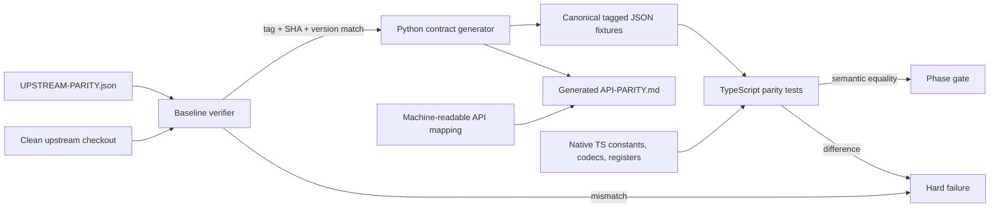

# Phase 1: Reproducible Semantic Contract - Research

**Researched:** 2026-07-14
**Domain:** Cross-language API, codec, register-schema, and golden-contract parity
**Confidence:** HIGH

<user_constraints>

## User Constraints (from CONTEXT.md)

### Locked Decisions

## Implementation Decisions

### Public TypeScript API

- Use `camelCase` for functions and methods and `PascalCase` for classes; every
  language-level rename is documented in the Python-to-TypeScript API mapping.
- Export Modbus/core capabilities from the package root and web capabilities
  exclusively from `@xerolux/idm-heatpump/web`.
- Return register maps as `ReadonlyMap<string, RegisterDef>` and provide
  registry helpers; normalize maps only at contract serialization boundaries.
- Model runtime enums as frozen `as const` objects with derived union types;
  do not use TypeScript `enum`.

### Parity Artifacts and Contract Generator

- Commit golden fixtures and regenerate them in CI from the exact pinned
  Python commit; any unapproved generated diff fails verification.
- Store representative complete model maps and exhaustively test builder
  parameters, model gates, and feature boundaries instead of persisting every
  combinatorial model permutation.
- Maintain a machine-readable API mapping as the source and generate
  `docs/API-PARITY.md` from it while checking coverage against Python `__all__`.
- Encode `NaN`, positive/negative infinity, and negative zero with explicit
  tagged JSON values so contract transport is lossless.

### Register and Codec Model

- Represent `RegisterDef` as an immutable plain object created through a
  central validating factory rather than a mutable class.
- Define datatypes with frozen `as const` values and derived union types;
  centralize datatype size and codec lookup.
- Return decoded sentinel values exactly as Python does and expose their
  meaning through metadata; do not silently convert sentinels to `null`.
- Implement IDM Float32 with bit-exact `DataView` operations in documented
  low-word-first order, preserving negative zero and non-finite values in
  contracts.

### the agent's Discretion

- Internal file boundaries, helper names, and generation implementation are at
  the agent's discretion when they preserve the accepted public and contract
  behavior.

### Deferred Ideas (OUT OF SCOPE)

- Modbus transport behavior and runtime detection belong to Phase 2.
- Real and simulated writes belong to Phase 3.
- Navigator 10 WebSocket and Navigator 2.0 HTTP clients belong to Phase 4.
- Publication, coordinated-release automation, and final parity closure belong
  to Phase 5.

</user_constraints>

<phase_requirements>

## Phase Requirements

| ID      | Description                                                                                                                                                                                                                                                                                                                  | Research Support                                                                                                                                                               |
| ------- | ---------------------------------------------------------------------------------------------------------------------------------------------------------------------------------------------------------------------------------------------------------------------------------------------------------------------------- | ------------------------------------------------------------------------------------------------------------------------------------------------------------------------------ |
| PAR-01  | Maintainers can generate and verify `UPSTREAM-PARITY.json`, the public export inventory, `docs/API-PARITY.md`, codec vectors, and normalized golden register schemas for every relevant model/feature combination; TypeScript types, codecs, and all register builders match those contracts, including documented overlaps. | The generator, artifact, immutable model, codec, and builder strategy below gives exact inputs, outputs, boundaries, and tests.                                                |
| BASE-01 | Every parity run uses an authoritative checked baseline containing repository URL, Python package version, fixed tag, full commit SHA, and parity-schema version, and rejects branch-only or mismatched references.                                                                                                          | The local Git object proves `v0.7.6` resolves to the manifest SHA; the baseline-verifier design checks URL, tag, SHA, and `pyproject.toml` before importing upstream code.     |
| API-01  | Every public Python export has a documented, semantically equivalent TypeScript counterpart with equivalent defaults and validation; only the parity contract's explicit language normalizations are accepted.                                                                                                               | The pinned package has exactly 89 `__all__` symbols, classified into 59 core/root and 30 web/subpath mappings, with lifecycle ownership and normalization rules defined below. |
| API-02  | `docs/API-PARITY.md` is generated from or validated against the public Python API and records each Python symbol, TypeScript counterpart, development status, and contract test; release permits only complete or explicitly reviewed legitimate `not_applicable` entries.                                                   | A committed machine-readable mapping is the editable source; Python `__all__` is the generated inventory; a one-to-one coverage gate and generated Markdown prevent drift.     |
| REG-01  | For every supported model and feature combination, normalized Python and TypeScript register schemas agree on all contract fields, preserve official logical overlaps, and introduce no substantive difference.                                                                                                              | The upstream snapshot's 3 representative maps, 26 fields, builder boundary matrix, model gates, and overlap assertions are enumerated below.                                   |
| COD-01  | Identical raw registers decode to identical domain values and identical writable values encode to identical 16-bit words, including low-word-first Float32, NaN, Infinity, integer boundaries, signs, and multipliers.                                                                                                       | Primitive and register-aware codec layers, tagged number transport, Python half-even rounding, and mandatory vector classes are specified below.                               |
| CTR-01  | Cross-repository CI checks out the pinned Python reference and produces language-neutral JSON scenarios containing at least `name`, `configuration`, `transport_responses`, `clock`, `operation`, `expected_result`, `expected_requests`, and `expected_state`, with only contract-approved normalization.                   | The scenario schema, lossless value envelope, deterministic generation pipeline, and CI regeneration gate are specified below.                                                 |

</phase_requirements>

## Summary

Phase 1 should be implemented as a deterministic contract pipeline, not as a one-time manual port. `UPSTREAM-PARITY.json` pins Python `0.7.6`, tag `v0.7.6`, and commit `ad121ebf34a5f5e37204371c026927d77efcd15c`; the local Git repository confirms both that the commit exists and that the tag resolves to that exact commit, while the pinned `pyproject.toml` reports version `0.7.6`. [VERIFIED: `UPSTREAM-PARITY.json` and local Git object database]

The pinned Python root exports exactly 89 symbols: 15 from `client`, 35 from `const`, 9 from `registers`, and 30 from `web`. The accepted Node boundary maps the 59 non-web symbols to the package root and all 30 web symbols exclusively to `@xerolux/idm-heatpump/web`; later-phase implementations can remain `planned` in the mapping during development, but every symbol must already have an explicit owner and intended TypeScript counterpart. [VERIFIED: pinned `idm_heatpump/__init__.py` and `01-CONTEXT.md`]

The semantic implementation should have two independent comparison surfaces: (1) committed Python-generated golden contracts and (2) TypeScript serializers/tests that produce the same normalized values from native TypeScript implementations. This keeps Python out of the runtime package while making drift visible as a byte-stable fixture diff and a failing behavioral test. [VERIFIED: `AGENTS.md`, `docs/PARITY-CONTRACT.md`, and `docs/IMPLEMENTATION-PLAN.md`]

**Primary recommendation:** Build the baseline verifier and contract schema first, then implement native types/codecs and register builders against committed contracts, and make CI regenerate those contracts from a clean checkout of the exact tag/SHA before accepting Phase 1.

## Architectural Responsibility Map

| Capability                     | Primary Tier                 | Secondary Tier                 | Rationale                                                                                                                                                                     |
| ------------------------------ | ---------------------------- | ------------------------------ | ----------------------------------------------------------------------------------------------------------------------------------------------------------------------------- |
| Baseline verification          | Development/CI tooling       | Source-control boundary        | It validates the upstream repository, tag, commit, package version, and schema before upstream code is executed. [VERIFIED: BASE-01 and `UPSTREAM-PARITY.json`]               |
| Python contract generation     | Development/CI tooling       | Pinned Python reference        | Python is permitted only to emit authoritative development fixtures, never as an npm runtime dependency. [VERIFIED: `AGENTS.md` and PKG-01]                                   |
| API mapping and generated docs | Documentation/contract layer | Root and web export boundaries | The mapping owns language renames, export path, phase ownership, status, and evidence without coupling later clients into Phase 1. [VERIFIED: `01-CONTEXT.md`]                |
| Datatypes and codecs           | Domain core                  | Contract serializer            | Native TypeScript owns runtime encoding/decoding; serializer tagging only makes exceptional numeric states lossless in JSON. [VERIFIED: pinned `client.py` and COD-01]        |
| Register definitions/builders  | Domain core                  | Registry/contract serializer   | Runtime maps stay native `ReadonlyMap`; sorting and key conversion happen only when producing contracts. [VERIFIED: `01-CONTEXT.md`]                                          |
| Cross-language comparison      | Test/parity layer            | CI                             | Tests compare normalized observable values and schema fields, while generation checks that committed expectations are fresh. [VERIFIED: CTR-01 and `docs/PARITY-CONTRACT.md`] |

## Verified Upstream Contract Surface

### Baseline facts

- `UPSTREAM-PARITY.json` currently contains repository `https://github.com/Xerolux/idm-heatpump-api`, package `idm-heatpump-api`, version `0.7.6`, tag `v0.7.6`, full SHA `ad121ebf34a5f5e37204371c026927d77efcd15c`, and parity schema version `1`. [VERIFIED: `UPSTREAM-PARITY.json`]
- The local source repository's current branch is newer than the pinned baseline, so a generator that imports the sibling checkout's current `HEAD` would be non-reproducible even though the relevant files happen to be unchanged today. Always verify and use the manifest commit. [VERIFIED: local Git `HEAD` and pinned commit]
- The pinned project requires Python `>=3.12` and `pymodbus>=3.12.1,<4.0`; semantic generation imports client/register modules, so CI should use Python 3.12 and a deliberately pinned compatible `pymodbus` version rather than whatever happens to be globally installed. [VERIFIED: pinned `pyproject.toml`]
- `docs/BASELINE.md` and `docs/API-PARITY.md` do not yet exist in the Node repository. The manifest remains authoritative; create the former as a generated human-readable baseline report and the latter as the required generated API matrix. [VERIFIED: Node repository file inventory]

### Public API inventory

| Python source group | Symbol count | Node export boundary        | Phase-1 treatment                                                                                                                                                                                                                |
| ------------------- | -----------: | --------------------------- | -------------------------------------------------------------------------------------------------------------------------------------------------------------------------------------------------------------------------------- |
| `client`            |           15 | Package root                | Implement semantic values/helpers that require no I/O now; map `IdmModbusClient` and I/O-dependent behavior to their later owning phases without exporting partial behavior. [VERIFIED: pinned `__init__.py` and phase boundary] |
| `const`             |           35 | Package root                | Port exactly, including numeric option keys, set/list semantics, and defaults. [VERIFIED: pinned `const.py`]                                                                                                                     |
| `registers`         |            9 | Package root                | Implement registry, map, lookup, builder, and schema behavior now. [VERIFIED: pinned `registers.py`]                                                                                                                             |
| `web`               |           30 | `@xerolux/idm-heatpump/web` | Record every mapping now; implementation and complete status remain Phase 4. [VERIFIED: pinned `__init__.py` and `01-CONTEXT.md`]                                                                                                |

The mapping must preserve aliases as separate public entries. Python's short web aliases (`AuthenticationError`, `ConnectionError`, `CsrfError`, `PinRejectedError`, `ProtocolError`, `TimeoutError`, and `WebSocketError`) point to IDM-prefixed classes but are still distinct names in `__all__`; the Node subpath must map and eventually export those aliases explicitly. [VERIFIED: pinned `web.py` and `__init__.py`]

### Register snapshot

The pinned `tests/fixtures/register_schema_v1.json` has schema version 1 and three representative complete maps: `default` with 267 registers, `navigator_10_full` with 587, and `navigator_20_circuit_a` with 105. [VERIFIED: pinned `tests/fixtures/register_schema_v1.json`]

Each serialized register has these 26 contract fields: `address`, `datatype`, `name`, `unit`, `writable`, `min_val`, `max_val`, `enum_options`, `multiplier`, `register_type`, `eeprom_sensitive`, `cyclic_required`, `cyclic_write_ttl`, `binary`, `enabled_by_default`, `state_class`, `icon`, `write_only`, `write_class`, `exclude_from_write`, `source`, `source_version`, `supported_models`, `sentinel_values`, `last_verified`, and `size`. [VERIFIED: pinned `test_register_schema.py` and fixture]

The full A-G map intentionally has exactly the documented logical boundary overlaps at address 1393 (`humidity_sensor` / `hc_a_mode`), 1442 (`hc_g_heating_curve` / `hc_a_heating_limit`), and 1484 (`hc_g_room_setpoint_cool_eco` / `hc_a_cooling_limit`). A parity test must assert this positive overlap set; it must never assert global non-overlap. [VERIFIED: pinned `test_registers.py` and `docs/Register-Map-Invariants.md`]

## Standard Stack

No new npm dependency is required for Phase 1. Use the installed and locked repository toolchain plus Node/Python standard libraries. [VERIFIED: `package.json`, `package-lock.json`, and implementation requirements]

### Core

| Library/runtime         | Version                         | Purpose                                                                   | Why Standard Here                                                                                                                                                       |
| ----------------------- | ------------------------------- | ------------------------------------------------------------------------- | ----------------------------------------------------------------------------------------------------------------------------------------------------------------------- |
| Node.js                 | `>=22` (CI 22 and 24)           | Runtime, scripts, native `DataView`, filesystem/process primitives        | This is the declared package runtime and test matrix. [VERIFIED: `package.json` and `.github/workflows/ci.yml`]                                                         |
| TypeScript              | `6.0.3` (published 2026-04-16)  | Strict domain model and declarations                                      | Already locked with strict, exact-optional, unchecked-index, and no-unused checks. [VERIFIED: npm registry and `package.json`]                                          |
| Vitest                  | `4.1.10` (published 2026-07-06) | Unit and parity tests with V8 coverage                                    | Already configured with 80% thresholds. [VERIFIED: npm registry and `vitest.config.ts`]                                                                                 |
| Python                  | `3.12+`                         | Runs the pinned reference generator only                                  | The pinned Python package declares Python 3.12 or newer. [VERIFIED: pinned `pyproject.toml`]                                                                            |
| Python standard library | 3.12                            | `argparse`, `json`, `math`, `struct`, `subprocess`, `tempfile`, `tomllib` | Sufficient for deterministic contract generation and baseline checks; avoids adding a generator dependency. [VERIFIED: required generator operations and Python stdlib] |

### Supporting

| Library               | Version                                                                                  | Purpose                                  | When to Use                                                                                                                                                               |
| --------------------- | ---------------------------------------------------------------------------------------- | ---------------------------------------- | ------------------------------------------------------------------------------------------------------------------------------------------------------------------------- |
| tsup                  | `8.5.1` (published 2025-11-12)                                                           | Existing ESM/CJS build                   | Keep unchanged; Phase 1 adds exports only after contract evidence exists. [VERIFIED: npm registry and `package.json`]                                                     |
| Prettier              | `3.9.5` (published 2026-07-09)                                                           | Deterministic source/docs formatting     | Format generated Markdown through a stable writer or the locked formatter. [VERIFIED: npm registry and `package.json`]                                                    |
| ESLint                | `10.7.0` (published 2026-07-10) with `typescript-eslint` `8.64.0` (published 2026-07-13) | Static quality gate                      | Existing lint boundary; no Phase-1 replacement is needed. [VERIFIED: npm registry and `package.json`]                                                                     |
| `@vitest/coverage-v8` | `4.1.10` (published 2026-07-06)                                                          | Branch/function/line/statement coverage  | Existing coverage provider matching Vitest. [VERIFIED: npm registry and `package.json`]                                                                                   |
| `pymodbus`            | `3.12.1` in generation CI                                                                | Allows import of pinned semantic modules | Pin the minimum supported version for deterministic Phase-1 generation; transport behavior is not exercised here. [VERIFIED: pinned `pyproject.toml` compatibility range] |

### Alternatives Considered

| Instead of                            | Could Use                   | Tradeoff                                                                                                                                                                                                                                             |
| ------------------------------------- | --------------------------- | ---------------------------------------------------------------------------------------------------------------------------------------------------------------------------------------------------------------------------------------------------- |
| Native `DataView`                     | Buffer or manual bit shifts | Buffer is Node-specific and manual shifts invite signedness/endianness errors; `DataView` is the locked decision and exposes explicit byte order. [CITED: https://developer.mozilla.org/en-US/docs/Web/JavaScript/Reference/Global_Objects/DataView] |
| Standard-library generator validation | Add a JSON-schema package   | A schema library could be useful if contracts become externally extensible, but the current fixed, repository-owned schema is small and does not justify a new supply-chain dependency. [VERIFIED: current contract scope]                           |
| Generated API Markdown                | Hand-maintained table       | Manual tables cannot prove one-to-one coverage of the 89-symbol `__all__` list. [VERIFIED: API-02 and pinned public API test]                                                                                                                        |

**Installation:** No Phase-1 package installation change is recommended. Keep the current lockfile and pin the Python generation environment in CI.

## Package Legitimacy Audit

Not applicable: Phase 1 should install no new npm packages. Existing packages are already locked, their selected versions were confirmed on the npm registry during this research, and no Phase-1 recommendation expands the dependency graph. [VERIFIED: npm registry and `package-lock.json`]

## Architecture Patterns

### System Architecture Diagram



This flow keeps source verification ahead of upstream imports, makes generated artifacts reviewable, and makes mismatches fail rather than degrade to warnings. [VERIFIED: BASE-01, CTR-01, and `AGENTS.md`]

### Recommended Project Structure

```text
contracts/
  api-mapping.json              # editable Python -> TypeScript ownership/mapping source
  normalization.md              # explicit allowed cross-language normalization rules
src/
  constants.ts
  types.ts
  errors.ts
  codec.ts
  contracts/
    tagged-values.ts            # JSON-only special-number and collection normalization
    scenario.ts                 # runtime contract parser/types
  registers/
    definitions.ts              # common groups or generated static definitions
    heating-circuits.ts
    zone-modules.ts
    registry.ts
    serialize.ts                # the only map-to-contract normalization boundary
    index.ts
scripts/
  generate-python-contract.py
  check-upstream-version.mjs    # exact local baseline check now; freshness expanded in Phase 5
  generate-api-parity.mjs
test/
  fixtures/
    public-api.json
    codec-vectors.json
    register-schema.json
    behavior-contract.json
    web-contract.json           # explicit deferred marker until Phase 4, rejected by release gate
  parity/
    baseline.test.ts
    api-parity.test.ts
    codec-contract.test.ts
    register-schema.test.ts
    scenario-schema.test.ts
  registers/
    register-def.test.ts
    builders.test.ts
docs/
  BASELINE.md
  API-PARITY.md
```

This structure follows the repository's documented package boundaries and keeps generated contracts out of the published `dist` tarball. [VERIFIED: `docs/IMPLEMENTATION-PLAN.md` and `package.json` `files`]

### Pattern 1: Verify Before Import

The generator must accept an explicit upstream checkout path, load `UPSTREAM-PARITY.json`, and perform all of these checks before adding that checkout to `sys.path` or importing `idm_heatpump`:

1. canonical repository URL equals the allowlisted manifest URL;
2. `git rev-parse HEAD` equals the full manifest SHA;
3. `git rev-parse <tag>^{commit}` equals the same SHA;
4. pinned `pyproject.toml` package version equals `python_version`;
5. tag equals `v<python_version>` and parity schema is supported.

These checks prevent a branch, newer sibling checkout, moved working tree, or mismatched tag from silently generating authoritative-looking fixtures. [VERIFIED: BASE-01 and local newer upstream `HEAD`]

### Pattern 2: One Canonical Normalizer

Use one recursive normalizer in Python and a mirror decoder/encoder in TypeScript. It must handle only contract-approved differences: `None`/`null`, tuple/readonly array, sorted set/array, enum/value, sorted map entries, and tagged exceptional numbers. Register maps stay as `ReadonlyMap` until the serializer calls the normalizer. [VERIFIED: `docs/PARITY-CONTRACT.md` and `01-CONTEXT.md`]

Use a single reserved envelope such as:

```json
{ "$number": "NaN" }
{ "$number": "+Infinity" }
{ "$number": "-Infinity" }
{ "$number": "-0" }
```

Reject any object that combines `$number` with other keys, and reject unknown tag values. This keeps the representation unambiguous and prevents silent conversion of non-finite values to JSON `null`. [VERIFIED: locked special-number decision and JSON behavior]

### Pattern 3: Separate Primitive and Register-Aware Codecs

The pinned Python code exposes primitive `ModbusCodec` methods and separate register-aware encode/decode behavior on `IdmModbusClient`. Primitive Float32 preserves NaN, infinities, and negative zero; register-aware float decode maps NaN/infinity to `None`, multiplies and rounds finite values to two decimal places, while sentinels remain ordinary decoded values. [VERIFIED: pinned `client.py`]

The TypeScript port should preserve that separation even if the public API later places register-aware methods elsewhere. Otherwise a test intended for primitive bit parity can accidentally enforce high-level unavailable-value semantics, or vice versa. [VERIFIED: COD-01 and pinned method behavior]

### Pattern 4: API Mapping Is the Editable Source

Store one object per Python public symbol with at least:

```json
{
  "python_symbol": "build_register_map",
  "typescript_symbol": "buildRegisterMap",
  "export_path": ".",
  "kind": "function",
  "owner_phase": 1,
  "status": "complete",
  "contract_test": "test/parity/register-schema.test.ts",
  "normalizations": ["snake_case_to_camelCase"]
}
```

The generator obtains Python `__all__` from the pinned source, then fails for a missing, extra, or duplicate mapping. It writes `public-api.json` and renders `docs/API-PARITY.md`; generated Markdown is never the mapping source. [VERIFIED: API-01, API-02, and locked mapping decision]

During Phase 1, later-owned symbols may be `planned` but must already have their exact TypeScript name, export path, owner phase, and intended contract test category. The release gate in Phase 5 must reject `planned`, `partial`, or unjustified `not_applicable`. [VERIFIED: `docs/PARITY-CONTRACT.md`]

### Pattern 5: Representative Schemas Plus Exhaustive Builder Boundaries

Persist the three complete upstream maps unchanged in meaning, then generate compact builder cases for:

- heating circuits A-G plus invalid letters and malformed multi-character values;
- zone indices 1-10, room counts 1-8, and invalid boundary values;
- manual `circuits`, `zone_modules`, and `rooms_per_zone` boundaries and precedence;
- Navigator 10, Navigator 2.0, Navigator Pro, and Unknown model gates;
- each optional Solar/ISC/PV/Cascade flag independently and the all-on/all-off boundaries;
- all seven heating-circuit inclusion boundaries and zone-module counts 0-10;
- default/core lookup differences and detection-register summaries.

Representative complete maps prove every metadata field; compact builder cases prove parameter and gate behavior without storing every Cartesian product as another full schema. [VERIFIED: pinned register tests, fixture, and locked test strategy]

### Pattern 6: Immutable Definitions, Cache-Safe Map Results

`createRegisterDef()` should validate, clone, and freeze all nested collections before freezing the returned object. Datatype size is derived centrally (`FLOAT` is 2; all other current datatypes are 1), and write class is derived from write metadata rather than accepted as contradictory input. [VERIFIED: pinned `RegisterDef.__post_init__`, `write_class`, and locked object decision]

Builder caches may hold internal maps, but each public result must be a fresh map or a mutation-proof view so consumer mutation cannot alter cached future results. A TypeScript `ReadonlyMap` annotation alone does not protect runtime state from a cast; tests must at least prove that mutating one returned map cannot affect a later build. [VERIFIED: pinned builder returns a shallow copy and locked `ReadonlyMap` API]

### Anti-Patterns to Avoid

- **Importing the sibling upstream `HEAD`:** it is currently newer than the baseline and is not the reproducible reference. [VERIFIED: local Git]
- **Treating generated fixture order as semantic:** canonicalize key ordering, but never remove or merge overlapping register definitions. [VERIFIED: register invariants]
- **Using `JSON.stringify` directly for all numbers:** non-finite numbers become `null`, hiding differences; negative zero also needs an explicit tag. [VERIFIED: locked decision]
- **Using `Math.round` for Python integer scaling:** Python rounds exact ties to even; JavaScript `Math.round` has different tie behavior. [CITED: https://docs.python.org/3.12/library/functions.html#round]
- **Using only the high-level float decoder for codec vectors:** it intentionally maps non-finite values to `None`; primitive `ModbusCodec` must still preserve their bit patterns. [VERIFIED: pinned `client.py`]
- **Freezing only the outer `RegisterDef`:** nested option objects/arrays/sets would remain mutable and could corrupt shared definitions. [VERIFIED: locked immutable-object decision]
- **Adding a no-overlap validation:** official logical ranges overlap at documented boundaries. [VERIFIED: `docs/Register-Map-Invariants.md`]
- **Exporting stubs that appear functional:** maintain mapping ownership/status during development, but do not expose a partial client or web implementation as complete. [VERIFIED: `AGENTS.md` no-partial-release rule]

## Exact Contract and Generator Strategy

### Deterministic generation algorithm

1. Read and strictly validate `UPSTREAM-PARITY.json` without importing upstream code.
2. Verify checkout URL, `HEAD`, tag resolution, pinned `pyproject.toml` version, and supported parity-schema version.
3. Read Python `__all__` and assert all symbols are importable in the pinned environment; serialize the ordered inventory and source group.
4. Validate `contracts/api-mapping.json` as a one-to-one mapping of that inventory and render `docs/API-PARITY.md` and `docs/BASELINE.md`.
5. Generate primitive and register-aware codec vectors, using tagged values for NaN, infinities, and negative zero and normalized error objects for rejected cases.
6. Build the three representative Python register maps exactly as upstream `test_register_schema.py` does, serialize all 26 fields, and assert the result equals the pinned upstream snapshot before emitting the Node fixture.
7. Generate compact exhaustive builder/gate summaries and positive overlap expectations.
8. Emit Phase-1 semantic scenarios with every CTR-01 field.
9. Write stable UTF-8 JSON with sorted keys where order is not semantic, fixed indentation/newline, and atomic replacement.
10. In `--check` mode, write to a temporary directory and byte-compare against committed artifacts; report paths and first semantic difference, then exit non-zero without modifying the worktree.

Every step above is grounded in the pinned tests or accepted contract and avoids relying on manual expected values. [VERIFIED: pinned tests, PAR-01, BASE-01, API-02, REG-01, COD-01, CTR-01]

### Scenario schema

Each entry in `behavior-contract.json` must include these fields even when a semantic-only scenario uses empty request/clock arrays:

```json
{
  "name": "codec_float32_negative_zero",
  "configuration": { "datatype": "FLOAT" },
  "transport_responses": [],
  "clock": [],
  "operation": { "kind": "encode_primitive", "value": { "$number": "-0" } },
  "expected_result": [0, 32768],
  "expected_requests": [],
  "expected_state": {}
}
```

Add a `schema_version` and full baseline identity at the fixture root. Reject missing fields, unknown operation kinds, duplicate scenario names, out-of-range words, and unrecognized tagged values. [VERIFIED: CTR-01 and locked tagged-value decision]

### Error normalization

The parity contract currently lists value and collection normalizations but does not define a stable shape for constructor/builder validation errors. Phase 1 should add an explicit rule before comparing rejected cases, for example `{ "category": "validation", "code": "invalid_circuit", "message": "..." }`, where the stable code is semantic and raw Python/TypeScript exception classes are retained only as diagnostic fields. [VERIFIED: `docs/PARITY-CONTRACT.md` normalization list and pinned `ValueError` paths]

Do not silently treat Python `ValueError`, `KeyError`, and TypeScript `TypeError`/`RangeError` as equal without this documented normalization. Message text can differ by language, but accepted input domains, rejection category, and stable reason must not. [VERIFIED: API-01]

## Codec Findings and Required Vectors

### Primitive bit behavior

The Python primitive codec uses `struct.pack("<f")` and `struct.pack("<HH")`. Official Python documentation confirms `f` is IEEE-754 binary32 regardless of platform, and official `DataView` documentation exposes explicit little-endian reads/writes suitable for the same layout. [VERIFIED: pinned `client.py`; CITED: https://docs.python.org/3.12/library/struct.html and https://developer.mozilla.org/en-US/docs/Web/JavaScript/Reference/Global_Objects/DataView/getFloat32]

Verified Python examples are:

| Value           | Low-word-first words | Primitive decode |
| --------------- | -------------------- | ---------------- |
| `0.0`           | `[0, 0]`             | positive zero    |
| `-0.0`          | `[0, 32768]`         | negative zero    |
| `1.0`           | `[0, 16256]`         | `1.0`            |
| `-1.0`          | `[0, 49024]`         | `-1.0`           |
| canonical `NaN` | `[0, 32704]`         | `NaN`            |
| `+Infinity`     | `[0, 32640]`         | `+Infinity`      |
| `-Infinity`     | `[0, 65408]`         | `-Infinity`      |

[VERIFIED: pinned `ModbusCodec` executed in the local reference environment]

Mandatory primitive vectors should also cover subnormal/minimum/maximum finite Float32, both `swapped` modes, extra input words, too-short input, non-integer/out-of-range words, INT8/INT16 limits, and values outside Float32 range. JavaScript `DataView.setFloat32` can narrow a large finite Number to infinity where Python packing rejects an out-of-range value, so the TypeScript wrapper must validate representability and match the Python failure contract. [VERIFIED: pinned implementation behavior and DataView numeric narrowing semantics]

### Register-aware behavior

The pinned register-aware codec supports `FLOAT`, `UCHAR`, `INT8`, `INT16`, `UINT16`, `BOOL`, and `BITFLAG`. It applies multipliers on decode, rounds finite numeric results to two decimal places, masks UCHAR/INT8/BITFLAG to the low byte, uses signed two's-complement for INT8/INT16, and rejects empty/short word arrays. [VERIFIED: pinned `client.py` and `test_value_boundaries.py`]

Python's integer encoding performs `round()` before `int()` for UCHAR/INT8/INT16/UINT16, so ties are round-to-even: `0.5 -> 0`, `1.5 -> 2`, `2.5 -> 2`, `-1.5 -> -2`, and `-2.5 -> -2`. This is a required cross-language vector class. [VERIFIED: pinned codec executed locally; CITED: https://docs.python.org/3.12/library/functions.html#round]

The high-level float decoder maps raw NaN and infinities to `None`/`null`, while `1.125` decodes to `1.12`; negative zero and sentinel values require separate assertions. Sentinels such as `-1.0`, `254`, and `255` remain the decoded value and are interpreted through metadata, not converted to null. [VERIFIED: pinned `client.py`, `test_registers.py`, and hardware sentinel fixture]

Codec fixtures must therefore distinguish `layer: "primitive"` from `layer: "register"` and include both accepted results and normalized rejection expectations. [VERIFIED: two distinct pinned API layers]

## Register Model Findings

### Immutable `RegisterDef` factory contract

The TypeScript factory must accept the Python fields except derived `size` and `write_class`, apply Python defaults, and enforce at least these invariants:

- datatype and register type are known frozen-object values;
- address is a non-negative integer;
- source/source version are non-empty and at least one supported model exists;
- multiplier is finite and non-zero;
- min/max are finite when present and min does not exceed max;
- EEPROM, cyclic, write-only, or excluded-value metadata requires `writable`;
- EEPROM and cyclic cannot both be true;
- cyclic TTL requires cyclic mode and must be finite and positive;
- size derives from datatype and write class derives in order: forbidden, write-only, cyclic, EEPROM, volatile.

[VERIFIED: pinned `RegisterDef.__post_init__` and `write_class`]

The factory should additionally validate integer/string collection members and clone/freeze nested values because the locked TypeScript design is stronger than Python's mutable dataclass. This is an idiomatic representation difference, not a semantic weakening. [VERIFIED: `01-CONTEXT.md`]

### Builder behavior that must not be simplified

- `build_register_map()` without detected model returns the complete backward-compatible map and includes all A-G circuits and optional blocks by default. [VERIFIED: pinned `registers.py` and 267-register default fixture]
- With `model_info`, its active circuits and zone count take priority over manual parameters; optional blocks follow feature flags, and Navigator-10-only blocks are excluded for Navigator 2.0, Pro, and Unknown. [VERIFIED: pinned `_build_register_map_impl` and tests]
- Heating-circuit addresses use official A-G formulas that intentionally create the three boundary overlaps. [VERIFIED: pinned builder and invariants]
- Zone modules use base `2000 + (zone - 1) * 65`; room blocks are seven addresses wide, current default is six rooms, and valid room counts extend through eight. [VERIFIED: pinned builder and tests]
- `CORE_REGISTERS` contains five entries. `get_all_registers()` and `get_register_registry()` default to the core set, while `get_register()` first checks core and then falls back to the complete default map. Do not normalize these three APIs into identical default behavior. [VERIFIED: pinned `registers.py`]
- `RegisterRegistry` may reject duplicate exact `(register_type, start address)` keys, but it must allow overlapping occupied ranges and never build a global no-overlap invariant. [VERIFIED: pinned registry and invariants]

### Contract serialization rules

Serialize maps by sorted canonical register name. Convert numeric enum keys to decimal strings, sort excluded values, preserve supported-model and sentinel sequence semantics, and tag only exceptional numeric values. A TypeScript `ReadonlyMap` is converted to a plain object only in `registers/serialize.ts`. [VERIFIED: pinned `test_register_schema.py` and locked map boundary]

Do not reuse the registry's abbreviated `to_schema()` output as the parity schema; it omits many of the 26 required fields. [VERIFIED: pinned `RegisterRegistry.to_schema` versus `test_register_schema.py`]

## Concrete Artifacts This Phase Must Produce

| Artifact                                                  | Source of truth                                                      | Required verification                                                                                                                                                                   |
| --------------------------------------------------------- | -------------------------------------------------------------------- | --------------------------------------------------------------------------------------------------------------------------------------------------------------------------------------- |
| `contracts/api-mapping.json`                              | Human-reviewed language mapping plus pinned `__all__`                | Exactly 89 unique Python entries; no missing/extra symbol; root/web boundary enforced. [VERIFIED: pinned API inventory]                                                                 |
| `docs/API-PARITY.md`                                      | Generated from mapping + public inventory                            | Fresh generation, status enum valid, evidence path exists, later owner recorded. [VERIFIED: API-02]                                                                                     |
| `docs/BASELINE.md`                                        | Generated from `UPSTREAM-PARITY.json` and verified checkout          | URL/version/tag/full SHA/schema shown; no independent editable baseline facts. [VERIFIED: BASE-01]                                                                                      |
| `test/fixtures/public-api.json`                           | Pinned `__all__`                                                     | Ordered inventory, source group, baseline identity. [VERIFIED: pinned public API test]                                                                                                  |
| `test/fixtures/codec-vectors.json`                        | Executed pinned primitive/register codecs                            | Tagged exceptional numbers, boundaries, multipliers, rounding, accepted and rejected cases. [VERIFIED: COD-01]                                                                          |
| `test/fixtures/register-schema.json`                      | Executed pinned builders cross-checked with upstream schema snapshot | Three full maps, 26 fields, compact builder cases, positive overlap set. [VERIFIED: REG-01]                                                                                             |
| `test/fixtures/behavior-contract.json`                    | Pinned semantic scenarios                                            | Every scenario contains all CTR-01 fields and passes runtime schema validation. [VERIFIED: CTR-01]                                                                                      |
| `test/fixtures/web-contract.json`                         | Explicit Phase-4 ownership marker in Phase 1                         | Exists because `AGENTS.md` requires it once implementation begins; clearly marked incomplete and release-blocking until Phase 4 replaces it. [VERIFIED: `AGENTS.md` and phase boundary] |
| `scripts/generate-python-contract.py`                     | Manifest + verified pinned checkout                                  | Deterministic generate/check modes; no import before verification; atomic output. [VERIFIED: BASE-01/PAR-01]                                                                            |
| `scripts/check-upstream-version.mjs`                      | Manifest + checkout                                                  | Phase 1 exact-reference mode; remote latest-stable scheduling remains Phase 5. [VERIFIED: `AGENTS.md` and deferred release automation]                                                  |
| Native `src/constants.ts`, `src/types.ts`, `src/codec.ts` | Pinned Python constants/client semantics                             | Golden and focused tests; only proven exports added to root. [VERIFIED: API-01/COD-01]                                                                                                  |
| Native `src/registers/*`                                  | Pinned builders/schema                                               | Schema equality, exhaustive builder boundaries, overlap tests, immutable/cache-safe behavior. [VERIFIED: REG-01]                                                                        |
| `.github/workflows/ci.yml` parity job                     | Exact manifest checkout                                              | Clean pinned checkout, Python 3.12, pinned compatible import dependency, generator `--check`, Node 22/24 tests. [VERIFIED: CTR-01 and existing CI matrix]                               |

## Don't Hand-Roll

| Problem                       | Don't Build                                                            | Use Instead                                                                  | Why                                                                                                                                           |
| ----------------------------- | ---------------------------------------------------------------------- | ---------------------------------------------------------------------------- | --------------------------------------------------------------------------------------------------------------------------------------------- |
| Float32 byte order            | Ad-hoc bit arithmetic or host-endian typed arrays                      | Native `DataView` with explicit `littleEndian=true` plus golden word vectors | Prevents signedness and host-endian drift. [CITED: https://developer.mozilla.org/en-US/docs/Web/JavaScript/Reference/Global_Objects/DataView] |
| Register expected values      | Manually copied TypeScript snapshots                                   | Pinned Python generator cross-checked with upstream snapshot                 | Manual copies can preserve transcription errors and cannot prove baseline freshness. [VERIFIED: PAR-01]                                       |
| API documentation             | Hand-edited Markdown matrix                                            | Machine mapping + generated Markdown + `__all__` coverage gate               | One source can prove all 89 entries and ownership. [VERIFIED: API-02]                                                                         |
| Special JSON numbers          | `null`, strings intermingled with real strings, or permissive revivers | Reserved tagged envelope with strict parser                                  | Preserves NaN/infinities/-0 without ambiguity. [VERIFIED: locked decision]                                                                    |
| Map overlap cleanup           | Shifted addresses, changed datatype, or merged logical points          | Exact official builders and positive overlap assertions                      | Overlaps are protocol facts, not data defects. [VERIFIED: register invariants]                                                                |
| Cross-language error equality | Raw message-string equality                                            | Explicit semantic error code/category in the contract                        | Runtime exception types and wording differ even when validation behavior is equivalent. [VERIFIED: API-01 and pinned error paths]             |

**Key insight:** Hand-written expected values would make the Node port another independent authority. The project requirement is the opposite: native TypeScript runtime code, but generated evidence whose only behavioral authority is the pinned Python implementation and its official register invariants.

## Common Pitfalls

### Pitfall 1: Correct SHA, Wrong Working Tree

**What goes wrong:** The generator reads a checkout containing uncommitted changes or a newer `HEAD` even though the manifest SHA is present locally.  
**Why it happens:** Checking only `git cat-file -e <sha>` proves the object exists, not that imported files come from it.  
**How to avoid:** Require clean checkout `HEAD == manifest SHA`, resolve the tag, and import only after checks.  
**Warning signs:** Fixtures change when unrelated upstream branch changes are present. [VERIFIED: current local upstream is newer than baseline]

### Pitfall 2: High-Level and Primitive Float Semantics Collapsed

**What goes wrong:** NaN/infinity either leak into domain values or are lost from primitive bit-vector tests.  
**Why it happens:** Both layers are called “codec” but Python exposes different behavior.  
**How to avoid:** Tag every vector with its layer and test both.  
**Warning signs:** Primitive NaN expected as null, or register decode returns NaN. [VERIFIED: pinned `client.py`]

### Pitfall 3: JavaScript Rounding Drift

**What goes wrong:** Scaled integer writes differ at `.5` ties or negative ties.  
**Why it happens:** `Math.round` is not Python's round-to-even.  
**How to avoid:** Implement and test a finite-number round-half-even helper used by integer encoders; cover exact and nearby ties.  
**Warning signs:** `2.5` encodes as `3` instead of `2`. [VERIFIED: Python execution and official Python docs]

### Pitfall 4: JSON Masks a Real Difference

**What goes wrong:** `NaN`/infinity turn into null and `-0` compares equal to `0`.  
**Why it happens:** Ordinary JSON has no distinct tokens for these states.  
**How to avoid:** Encode before serialization and compare tagged values structurally.  
**Warning signs:** Golden fixtures contain `null` for primitive non-finite vectors. [VERIFIED: locked contract decision]

### Pitfall 5: Schema “Cleanup” Breaks Protocol Identity

**What goes wrong:** Humidity or circuit values are read from shifted/wrong datatypes.  
**Why it happens:** A maintainer assumes occupied register ranges must be globally unique.  
**How to avoid:** Assert the documented overlap set and exact start/size metadata.  
**Warning signs:** A no-overlap test, humidity at anything other than `1392/FLOAT/2`, or HC-A mode moved from `1393/UCHAR/1`. [VERIFIED: register invariants]

### Pitfall 6: Generated Documentation Becomes a Second Source

**What goes wrong:** Mapping and Markdown disagree or a manual edit is overwritten.  
**Why it happens:** Both files appear editable.  
**How to avoid:** Put a generated header in Markdown and fail `--check` on drift; only `contracts/api-mapping.json` is editable.  
**Warning signs:** A symbol exists in Markdown but not mapping JSON. [VERIFIED: API-02]

### Pitfall 7: Overclaiming Phase-1 Completeness

**What goes wrong:** An unimplemented client/web symbol is exported or marked complete because its name is mapped.  
**Why it happens:** Inventory completeness is confused with behavioral completeness.  
**How to avoid:** Separate `counterpart assigned` from `status`; require evidence paths for `complete`, keep `private: true`, and defer I/O behavior to its owning phase.  
**Warning signs:** `IdmModbusClient` or a web client is a throwing stub in public output. [VERIFIED: phase boundary and no-partial-release rule]

## Code Examples

### Low-word-first Float32

```typescript
// Sources: pinned Python ModbusCodec and official DataView documentation.
export function encodeFloat32(value: number): readonly [number, number] {
  const buffer = new ArrayBuffer(4);
  const view = new DataView(buffer);
  view.setFloat32(0, value, true);
  return [view.getUint16(0, true), view.getUint16(2, true)];
}

export function decodeFloat32(words: readonly number[]): number {
  if (words.length < 2) throw new RangeError("FLOAT32 decoding requires two registers");
  const low = words[0];
  const high = words[1];
  if (!Number.isInteger(low) || low < 0 || low > 0xffff) throw new RangeError("invalid word");
  if (!Number.isInteger(high) || high < 0 || high > 0xffff) throw new RangeError("invalid word");
  const buffer = new ArrayBuffer(4);
  const view = new DataView(buffer);
  view.setUint16(0, low, true);
  view.setUint16(2, high, true);
  return view.getFloat32(0, true);
}
```

This is the core bit layout, but production encode must add the Python-compatible out-of-range check and `swapped` option proven by vectors. [VERIFIED: pinned `ModbusCodec`; CITED: https://developer.mozilla.org/en-US/docs/Web/JavaScript/Reference/Global_Objects/DataView/getUint16]

### Lossless special-number envelope

```typescript
export type TaggedNumber = Readonly<{
  $number: "NaN" | "+Infinity" | "-Infinity" | "-0";
}>;

export function normalizeNumber(value: number): number | TaggedNumber {
  if (Number.isNaN(value)) return Object.freeze({ $number: "NaN" });
  if (value === Number.POSITIVE_INFINITY) return Object.freeze({ $number: "+Infinity" });
  if (value === Number.NEGATIVE_INFINITY) return Object.freeze({ $number: "-Infinity" });
  if (Object.is(value, -0)) return Object.freeze({ $number: "-0" });
  return value;
}
```

The parser must require exactly one `$number` key and a known tag; do not use a permissive generic reviver. [VERIFIED: locked tagged-value decision]

### Register datatype model

```typescript
export const DataType = Object.freeze({
  FLOAT: "FLOAT",
  UCHAR: "UCHAR",
  INT8: "INT8",
  INT16: "INT16",
  UINT16: "UINT16",
  BOOL: "BOOL",
  BITFLAG: "BITFLAG",
} as const);

export type DataType = (typeof DataType)[keyof typeof DataType];

export const DATA_TYPE_SIZE: Readonly<Record<DataType, 1 | 2>> = Object.freeze({
  FLOAT: 2,
  UCHAR: 1,
  INT8: 1,
  INT16: 1,
  UINT16: 1,
  BOOL: 1,
  BITFLAG: 1,
});
```

This preserves a runtime value surface comparable to Python enums while providing an idiomatic derived TypeScript union. [VERIFIED: locked enum decision and pinned `DataType`]

## Environment Availability

| Dependency | Required By                           | Available | Version                             | Fallback                                                                                                                |
| ---------- | ------------------------------------- | --------- | ----------------------------------- | ----------------------------------------------------------------------------------------------------------------------- |
| Git        | Baseline/tag/SHA verification         | ✓         | 2.43.0                              | CI checkout provides Git. [VERIFIED: local command]                                                                     |
| Node.js    | TypeScript tests/scripts              | ✓         | 25.9.0 locally; declared target 22+ | CI explicitly runs 22 and 24. [VERIFIED: local command and workflow]                                                    |
| npm        | Locked scripts/build                  | ✓         | 11.12.1                             | Use repository lockfile. [VERIFIED: local command]                                                                      |
| Python     | Reference generator                   | ✓         | 3.12.3                              | CI setup-python 3.12. [VERIFIED: local command]                                                                         |
| pytest     | Optional upstream test confirmation   | ✓         | 9.1.1                               | Generator tests can use stdlib `unittest`; Node runtime never needs pytest. [VERIFIED: local command]                   |
| pymodbus   | Import pinned Python client/registers | ✓         | 3.13.1 locally                      | CI pin 3.12.1 within upstream range for deterministic generation. [VERIFIED: local command and pinned `pyproject.toml`] |

**Missing dependencies with no fallback:** None. [VERIFIED: environment audit]

**Missing dependencies with fallback:** None. [VERIFIED: environment audit]

The local Node runtime is newer than the declared CI targets, so acceptance must rely on the existing Node 22/24 matrix rather than local Node 25 alone. [VERIFIED: environment audit and CI workflow]

## Validation Architecture

### Test Framework

| Property           | Value                                                                                                       |
| ------------------ | ----------------------------------------------------------------------------------------------------------- |
| Framework          | Vitest `4.1.10` + V8 coverage; Python generator invoked as a development command [VERIFIED: `package.json`] |
| Config file        | `vitest.config.ts` [VERIFIED: repository]                                                                   |
| Quick run command  | `npm test -- test/parity/codec-contract.test.ts`                                                            |
| Full suite command | `npm run check && npm run parity:check`                                                                     |

The current bootstrap suite has 9 passing tests; no Phase-1 semantic/parity test files exist yet. [VERIFIED: local `npm test` on 2026-07-14]

### Phase Requirements → Test Map

| Req ID  | Behavior                                                                                     | Test Type                  | Automated Command                                                | File Exists? |
| ------- | -------------------------------------------------------------------------------------------- | -------------------------- | ---------------------------------------------------------------- | ------------ |
| BASE-01 | Manifest validation plus exact checkout/tag/version rejection                                | unit + process integration | `npm test -- test/parity/baseline.test.ts`                       | ❌ Wave 0    |
| API-01  | All 89 mappings have intended counterparts, defaults/normalizations, and correct export path | contract                   | `npm test -- test/parity/api-parity.test.ts`                     | ❌ Wave 0    |
| API-02  | Markdown generation is fresh and mapping exactly covers `__all__`                            | generation contract        | `npm run parity:api -- --check`                                  | ❌ Wave 0    |
| COD-01  | Primitive/register codec matches every golden vector and rejection                           | unit + golden              | `npm test -- test/parity/codec-contract.test.ts`                 | ❌ Wave 0    |
| REG-01  | Register factory/builders/schema/gates/overlaps match                                        | unit + golden              | `npm test -- test/registers test/parity/register-schema.test.ts` | ❌ Wave 0    |
| PAR-01  | All generated semantic artifacts are fresh and TypeScript consumes them                      | cross-repository contract  | `npm run parity:check`                                           | ❌ Wave 0    |
| CTR-01  | Scenario schema and tagged normalization are strict; required fields present                 | unit + schema              | `npm test -- test/parity/scenario-schema.test.ts`                | ❌ Wave 0    |

### Sampling Rate

- **Per task commit:** run the focused test file for the artifact being changed plus `npm run typecheck`.
- **Per wave merge:** run `npm test`, `npm run lint`, `npm run format:check`, and the relevant generator `--check` mode.
- **Phase gate:** run `npm run check && npm run parity:check` in a clean tree and CI on Node 22 and 24 before verification.

### Wave 0 Gaps

- [ ] `contracts/api-mapping.json` and its strict parser/schema.
- [ ] `scripts/generate-python-contract.py` with clean-checkout and deterministic `--check` support.
- [ ] `scripts/generate-api-parity.mjs` and `docs/API-PARITY.md`/`docs/BASELINE.md` generation.
- [ ] `test/parity/baseline.test.ts` — BASE-01.
- [ ] `test/parity/api-parity.test.ts` — API-01/API-02.
- [ ] `test/parity/codec-contract.test.ts` — COD-01.
- [ ] `test/registers/register-def.test.ts`, `test/registers/builders.test.ts`, and `test/parity/register-schema.test.ts` — REG-01.
- [ ] `test/parity/scenario-schema.test.ts` — CTR-01.
- [ ] `test/fixtures/public-api.json`, `codec-vectors.json`, `register-schema.json`, `behavior-contract.json`, and explicit deferred `web-contract.json`.
- [ ] npm scripts `parity:generate`, `parity:api`, and `parity:check`, wired into CI.

## Security Domain

### Applicable ASVS Categories

| ASVS Category         | Applies | Standard Control                                                                                                                                                                                  |
| --------------------- | ------- | ------------------------------------------------------------------------------------------------------------------------------------------------------------------------------------------------- |
| V2 Authentication     | no      | No authentication surface exists in Phase 1; web auth is Phase 4. [VERIFIED: phase boundary]                                                                                                      |
| V3 Session Management | no      | No sessions or tokens are handled. [VERIFIED: phase boundary]                                                                                                                                     |
| V4 Access Control     | no      | This is a local library/build-contract phase with no authorization boundary. [VERIFIED: phase scope]                                                                                              |
| V5 Input Validation   | yes     | Strict manifest parser, verified Git identity, runtime contract parser, register factory validation, word/range checks, and fixed operation kinds. [VERIFIED: requirements and pinned validation] |
| V6 Cryptography       | no      | No cryptographic primitive is needed; Git SHA is identity/equality evidence here, not a home-grown security signature. [VERIFIED: phase scope]                                                    |

### Known Threat Patterns for the Contract Toolchain

| Pattern                                              | STRIDE                           | Standard Mitigation                                                                                                                                                                                                              |
| ---------------------------------------------------- | -------------------------------- | -------------------------------------------------------------------------------------------------------------------------------------------------------------------------------------------------------------------------------- |
| Spoofed/moved upstream reference                     | Spoofing                         | Allowlist repository URL and require tag and `HEAD` to resolve to the manifest full SHA before imports. [VERIFIED: BASE-01]                                                                                                      |
| Fixture tampering or stale generation                | Tampering                        | Deterministic `--check`, committed goldens, baseline identity in every fixture, and hard CI diff failure. [VERIFIED: PAR-01]                                                                                                     |
| Executing upstream code with secrets                 | Elevation/Information disclosure | Execute only the verified pinned commit in a least-privilege CI job with read-only contents permission, no production secrets, and no live device access. [VERIFIED: `AGENTS.md` security constraints]                           |
| Sensitive device values in fixtures                  | Information disclosure           | Generator fixtures must contain synthetic inputs only and reject/document PINs, credentials, private IPs, device identifiers, and raw captures. [VERIFIED: `AGENTS.md` and upstream protocol docs]                               |
| Shell/path injection through checkout or output args | Tampering/Elevation              | Use argument arrays, fixed output allowlists, canonical paths, and no `shell=True`; write only known fixture/doc paths. [RECOMMENDED based on generator threat model]                                                            |
| Ambiguous tagged-value object                        | Tampering                        | Strictly require a one-key reserved envelope and known tags. [VERIFIED: locked lossless-number requirement]                                                                                                                      |
| Unbounded contract input                             | Denial of service                | Contracts are repository-owned, versioned, size-bounded files; parsers reject unsupported schema versions and excessive structures rather than recursively accepting arbitrary input. [RECOMMENDED based on V5 input validation] |
| Untraceable generated evidence                       | Repudiation                      | Embed repository/version/tag/full SHA/schema and generator version in each artifact. [VERIFIED: BASE-01]                                                                                                                         |

### Threat-model acceptance gate

The plan must include a threat model for scripts that clone/import upstream source. It must explicitly assert: no network device operations, no credentials in the job, no shell-interpolated manifest values, no artifact path chosen by upstream data, and no generation before exact commit verification.

## State of the Art

| Old Approach                        | Current Approach                                                | When Changed                                | Impact                                                                                               |
| ----------------------------------- | --------------------------------------------------------------- | ------------------------------------------- | ---------------------------------------------------------------------------------------------------- |
| Manual cross-language parity claims | Executable, pinned golden contracts and behavioral scenarios    | Locked by this repository's parity contract | Parity becomes a failing test rather than documentation prose. [VERIFIED: `docs/PARITY-CONTRACT.md`] |
| TypeScript `enum`                   | Frozen `as const` runtime object + derived union                | Locked for Phase 1                          | Preserves runtime values without enum emit behavior. [VERIFIED: `01-CONTEXT.md`]                     |
| JSON-native numbers only            | Strict special-number tags                                      | Locked for Phase 1                          | NaN, infinities, and negative zero survive contract transport. [VERIFIED: `01-CONTEXT.md`]           |
| Persist every model permutation     | Representative full maps + exhaustive atomic builder/gate tests | Locked for Phase 1                          | Strong boundary coverage without combinatorial fixture bloat. [VERIFIED: `01-CONTEXT.md`]            |

**Deprecated/outdated:**

- The upstream registry's abbreviated `to_schema()` is not sufficient for parity because it omits required metadata fields. [VERIFIED: pinned implementation]
- A branch name such as `main` is not a valid parity reference. [VERIFIED: BASE-01 and `docs/PARITY-CONTRACT.md`]
- A global no-overlap invariant is explicitly forbidden. [VERIFIED: both repositories' `AGENTS.md`]

## Project Constraints (from AGENTS.md)

- Read the parity contract, manifest, pinned upstream guidance, register invariants, API contract, protocol analysis, affected implementation, and tests before semantic changes; this research did so. [VERIFIED: Node `AGENTS.md` and research log]
- Preserve official addresses, datatypes, sizes, function codes, overlaps, sentinels, and model gates exactly; do not invent Node-only register corrections. [VERIFIED: both `AGENTS.md` files]
- Float32 is two words in low-word-first order, and physical validation follows full datatype decode. [VERIFIED: register invariants]
- Batch/read/write/runtime behavior is not implemented in Phase 1, but register metadata must not preclude exact later request shapes and safety rules. [VERIFIED: phase boundary and `AGENTS.md`]
- Navigator 1.0/1.7 remains excluded as a separate family. [VERIFIED: register invariants]
- TypeScript is strict, Node is 22+, CI covers 22/24, ESM is primary, and CJS comes from the same source. [VERIFIED: Node `AGENTS.md` and package config]
- Python is development/CI reference only; runtime artifacts must not depend on Python. [VERIFIED: PKG-01]
- Tests use deterministic synthetic inputs; no live hardware writes or sensitive identifiers are permitted. [VERIFIED: Node `AGENTS.md`]
- `private: true` remains until every phase and release gate is complete; no mapped-but-unimplemented symbol may be published as parity-complete. [VERIFIED: Node `AGENTS.md`]
- Required implementation artifacts include API parity docs, all four named fixture families, parity tests, the Python generator, and upstream checker. [VERIFIED: Node `AGENTS.md`]
- Definition of done includes tests, typecheck, lint, formatting, at least 80% branch coverage, controlled tarball contents/install, current docs/changelog, and accurate hardware-validation reporting. [VERIFIED: Node `AGENTS.md`]

## Assumptions Log

| #   | Claim                                                                                                                                                                            | Section | Risk if Wrong |
| --- | -------------------------------------------------------------------------------------------------------------------------------------------------------------------------------- | ------- | ------------- |
| —   | None. All factual claims were verified from the pinned local source/tests, the Node repository, local tool execution, npm metadata, or official Python/JavaScript documentation. | —       | —             |

## Open Questions

1. **Should `docs/BASELINE.md` be generated or omitted?**
   - What we know: the authoritative machine source is `UPSTREAM-PARITY.json`; the file was named as expected reading but does not exist. [VERIFIED: repository]
   - What's unclear: no binding project document explicitly requires this human-readable mirror.
   - Recommendation: generate it from the manifest so it cannot drift; never make it an independent source.

2. **Which stable semantic error codes should represent Python validation exceptions?**
   - What we know: identical accepted/rejected behavior is required, but the current parity contract does not enumerate non-transport error normalization. [VERIFIED: API-01 and parity contract]
   - What's unclear: exact naming (`invalid_circuit`, `invalid_zone_count`, etc.) is at implementation discretion.
   - Recommendation: define the small code list in `contracts/normalization.md` and generate both Python and TypeScript expectations from it before writing rejection tests.

3. **How should later-owned public classes appear during Phase 1?**
   - What we know: all 89 symbols need mapped counterparts, while transport/writes/web are explicitly later and partial public behavior is forbidden. [VERIFIED: API requirements and phase boundary]
   - What's unclear: whether a type-only declaration for a later class is valuable before runtime implementation.
   - Recommendation: record the final runtime name and owner phase in the mapping, keep status `planned`, and do not export a throwing runtime stub. The Phase-5 release gate resolves all statuses.

## Sources

### Primary (HIGH confidence)

- Node repository: `AGENTS.md`, `UPSTREAM-PARITY.json`, `docs/PARITY-CONTRACT.md`, `docs/IMPLEMENTATION-PLAN.md`, package/config/test files, and Phase-1 context.
- Pinned Python commit `ad121ebf34a5f5e37204371c026927d77efcd15c`: `AGENTS.md`, `docs/Register-Map-Invariants.md`, `docs/API-Contract.md`, `docs/Navigator-Protocol-Analysis.md`, `idm_heatpump/{__init__,const,client,registers,web}.py`, and relevant tests/fixture.
- Local Git verification that `v0.7.6` resolves to the pinned commit and the pinned `pyproject.toml` declares `0.7.6`.
- Local execution of pinned codec behavior and the existing Node test suite.

### Secondary (MEDIUM confidence)

- [MDN DataView](https://developer.mozilla.org/en-US/docs/Web/JavaScript/Reference/Global_Objects/DataView) - explicit endian-aware binary reads/writes.
- [MDN DataView.getFloat32](https://developer.mozilla.org/en-US/docs/Web/JavaScript/Reference/Global_Objects/DataView/getFloat32) - binary32 decode semantics.
- [Python 3.12 `struct`](https://docs.python.org/3.12/library/struct.html) - platform-independent IEEE-754 binary32 for `f`.
- [Python 3.12 `round`](https://docs.python.org/3.12/library/functions.html#round) - ties-to-even and binary-float caveats.
- npm registry metadata for the already-locked toolchain versions and publication dates.

### Tertiary (LOW confidence)

- None.

## Metadata

**Confidence breakdown:**

- Standard stack: HIGH - selected versions and runtime constraints are in the lockfile/manifests and were registry/environment verified.
- Architecture: HIGH - driven by locked decisions, requirements, both repositories' mandatory guidance, and the pinned implementation/tests.
- Codec semantics: HIGH - verified from pinned code, local execution, and official language documentation.
- Register semantics: HIGH - verified from official invariant guidance, pinned builders/tests, and the versioned schema snapshot.
- Pitfalls: HIGH - each is demonstrated by the pinned implementation, documented prior protocol failure, or official language behavior.

**Research date:** 2026-07-14  
**Valid until:** 2026-08-13 for tooling details; semantic findings remain valid while the baseline SHA stays unchanged.
