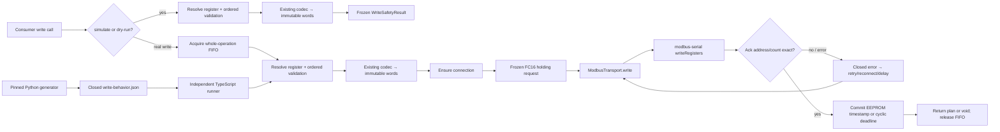

# Phase 3: Safe Write Parity - Research

**Researched:** 2026-07-17  
**Domain:** Safety-sensitive Modbus FC16 writes, deterministic time state, and pinned cross-repository behavioral parity  
**Confidence:** HIGH

<user_constraints>

## User Constraints (from CONTEXT.md)

### Locked Decisions

### Public Write API and Request Shape

- Promote exactly the mapped Python write surface with idiomatic names:
  `WriteSafetyResult`, `simulateWrite`, `writeRegister`, `setValue`,
  `resetWriteThrottle`, `getActiveCyclicWrites`,
  `getExpiredCyclicWrites`, and `resetCyclicWriteState`.
- `WriteSafetyResult` is an immutable readonly object/factory containing the
  exact register object, requested value, immutable encoded word array, and
  `dryRun` flag. Planning and dry-run never connect and never send.
- Extend the adapter-neutral transport with one exact immutable write request.
  Python calls `write_registers` for every accepted write, so both one- and
  multi-word writes use FC16 with the exact unit, holding-register address,
  count, and low-word-first payload.
- Preserve the existing whole-operation FIFO: validation, ensure/connect,
  every retry/reconnect/delay, write response validation, and successful state
  mutation are one serialized operation.

### Validation and Custom Registers

- Match Python validation order and domain reasons: writable/model membership,
  BOOL versus numeric type, finite numeric input, integer-only datatypes,
  excluded values, min/max, enum membership, then the existing authoritative
  codec. Never clamp, coerce invalid booleans, or hide codec errors.
- `allowCustomRegister` bypasses only detected-model map membership. It never
  bypasses writability, datatype, finite/integer, excluded-value, range, enum,
  address/count, holding-write, or encoding protections.
- Unknown string keys remain distinct from read-only or model-unavailable
  registers. String-key lookup uses the same model-aware registry semantics as
  Python; explicit `RegisterDef` inputs retain identity in the returned plan.
- Dry-run and rejected writes emit no transport request and cannot mutate
  connection, EEPROM, cyclic, or diagnostic success state.

### EEPROM and Cyclic Time State

- Use the already injected monotonic clock. EEPROM-sensitive registers retain
  Python's 60-second per-name throttle with the same boundary and one-decimal
  remaining-time diagnostic.
- Record an EEPROM timestamp only after a fully successful Modbus write.
  Resetting one register removes only its name; a no-argument reset clears the
  complete EEPROM throttle map.
- Successful cyclic writes set or refresh the per-name deadline to the
  register TTL or Python's 300-second default. The exact deadline, not a
  remaining duration, is returned.
- Active state uses `deadline > now`, expired state uses `deadline <= now`;
  both are immutable deterministic projections. Per-register and global cyclic
  resets match Python exactly.

### Retry, Error, and Evidence Closure

- Reuse Python's client-owned attempt count and exponential backoff. Transport
  connection failures reconnect; generic device/write failures retry without
  recording success. Preserve Python's operation-specific handling rather
  than assuming read-side Code-2 semantics automatically apply to writes.
- A failed validation, connection, device response, retry exhaustion, or
  malformed response must not record an EEPROM timestamp or cyclic deadline.
  The latest immutable error context uses operation `write`, exact address and
  count, a closed normalized kind, redacted endpoint, and no raw payload.
- Generate executable write scenarios from the exact pinned Python tag/SHA.
  Compare result/error, FC16 requests and words, controlled time, EEPROM and
  cyclic state, retries, reconnects, dry-run no-traffic, and failed-write
  rollback. Keep this evidence transactionally regenerated with the existing
  fixture/doc set.
- Tests use only deterministic fake transports and clocks. No live heat-pump
  write is authorized or implied, and diagnostics/fixtures must never contain
  a real endpoint or a sensitive write payload.

### the agent's Discretion

- Internal module boundaries for write planning, immutable state projection,
  transport response typing, and fixture parsing are at the agent's
  discretion when public mappings, validation order, exact FC16 traces,
  controlled time, and Python outcomes remain unchanged.
- The planner may either version the existing transport scenario schema or
  introduce a separate Phase-3 write fixture, choosing the approach with the
  strongest closed-schema and transactional evidence while preserving all
  Phase-2 read fixtures byte-for-byte unless the pinned generator requires a
  reviewed extension.

### Deferred Ideas (OUT OF SCOPE)

- Optional read-only web parity remains Phase 4.
- Latest-stable revalidation, public release metadata, and removal of
  `private: true` remain Phase 5.
- Live hardware validation is not performed or claimed.
  </user_constraints>

<phase_requirements>

## Phase Requirements

| ID                    | Description                                                                                                                                                           | Research Support                                                                                                                                                                                                                                                             |
| --------------------- | --------------------------------------------------------------------------------------------------------------------------------------------------------------------- | ---------------------------------------------------------------------------------------------------------------------------------------------------------------------------------------------------------------------------------------------------------------------------- |
| WRT-01                | Plan/dry-run and perform safe one-/multi-register writes with exact validation, custom-register protections, EEPROM throttling, and cyclic TTL.                       | Exact method defaults, validation order, immutable plan/state design, fake clock semantics, and state-commit boundary are specified below. [VERIFIED: pinned Python `client.py` and `test_value_boundaries.py`]                                                              |
| WRT-02                | Python and TypeScript accept/reject for the same reason and produce the same target/function/words; dry-run is traffic-free and failures cannot create success state. | A separate generated write scenario contract, closed validation codes, action matrix, request trace, time/state snapshot, and rollback tests are prescribed below. [VERIFIED: `docs/PARITY-CONTRACT.md`, pinned Python sources/tests]                                        |
| TRN-03W               | Accepted writes emit the same function/address/count/words; rejected and dry-run writes emit no traffic.                                                              | One frozen FC16 request type, strict 1..123 count/word/address validation, adapter echo validation, fake events, and generated request equality close the clause. [VERIFIED: Modbus V1.1b3 §6.12, `modbus-serial@8.0.25`, pinned Python `_write_registers`]                  |
| ERR-01W               | Validation, transport/device failures, reconnect, exhaustion, and failed state match Python without false success.                                                    | Operation-specific Code-2 normalization, exact retry table, write error contexts, failed-state snapshots, and deterministic transient/device/malformed scenarios close the clause. [VERIFIED: pinned Python `_retry_command` and `_write_registers`; Phase-2 error contract] |
| </phase_requirements> |

## Summary

Phase 3 should be implemented as an additive write state machine inside the existing `IdmModbusClient`, not as a second client or an adapter-owned policy layer. The existing FIFO, injected monotonic clock/sleep, codec, register registry, closed transport failures, transactional generator, API mapping, and package gates already provide every required seam. No register definition and no runtime dependency needs to change. [VERIFIED: target `src/client/idm-modbus-client.ts`, `src/codec.ts`, `src/registers`, `package.json`]

The pinned Python behavior is precise: lookup and validation happen before connection; every real accepted write uses pymodbus `write_registers`, hence FC16 even for one word; state is committed only after `_write_registers` returns; EEPROM uses a per-name 60-second window; cyclic state stores an absolute per-name deadline using a register TTL or 300 seconds. Generic write-side device errors, including a numeric Modbus Code 2 response after Python wraps it, are retried and never mark a register unsupported. [VERIFIED: pinned Python `client.py` lines 591-794 and 1166-1361]

The strongest evidence design is a new closed `write-behavior.json` plus a dedicated parser/runner. This preserves `transport-behavior.json` byte-for-byte and avoids reopening the proven Phase-2 read schema while still adding the new artifact to the existing all-or-nothing generation transaction. The fixture must be produced by executing the exact pinned Python checkout, never by copying TypeScript expectations. [VERIFIED: `03-CONTEXT.md`, current generator/check orchestrator]

**Primary recommendation:** Build the contract first, then the pure write planner/time state, then FC16 execution/retry and the real adapter, and only after all generated scenarios pass promote the client and `WriteSafetyResult` mappings to `complete`.

## Architectural Responsibility Map

| Capability                            | Primary Tier          | Secondary Tier                | Rationale                                                                                                                                                                                                 |
| ------------------------------------- | --------------------- | ----------------------------- | --------------------------------------------------------------------------------------------------------------------------------------------------------------------------------------------------------- |
| Public write API and immutable plan   | Node API/client       | Domain codec/registry         | Consumer semantics and defaults belong to `IdmModbusClient`; encoding and register authority remain delegated. [VERIFIED: target architecture and pinned Python class]                                    |
| Validation and model/custom policy    | Domain/client         | Register registry             | The client owns operation order and current model state; the registry remains the source of canonical definitions. [VERIFIED: pinned Python `_validate_write_allowed` and `_validate_model_availability`] |
| FC16 request/ack                      | Transport abstraction | `modbus-serial` adapter       | The domain emits a provider-neutral request; only the adapter maps it to `writeRegisters` and validates the provider response. [VERIFIED: target Phase-2 boundary; official Modbus specification]         |
| Retry, reconnect, FIFO, error context | Client state machine  | Transport error normalization | Python owns retries above the provider, with adapter retries fixed at zero. [VERIFIED: pinned Python `_retry_command`; target Phase-2 client]                                                             |
| EEPROM/cyclic state                   | Client state machine  | Injected monotonic clock      | These are per-client safety states committed after confirmed success. [VERIFIED: pinned Python `_record_successful_write`]                                                                                |
| Cross-repository evidence             | Development tooling   | Deterministic fakes/parsers   | Python produces authority; TypeScript independently executes and compares results/traces/state. [VERIFIED: `scripts/generate-python-contract.py`, `scripts/check-parity.mjs`]                             |
| Package/API promotion                 | Build/package tooling | Docs and phase gate           | Root exports must be derived from complete evidence and remain private while web parity is pending. [VERIFIED: API mapping and package checker]                                                           |

## Project Constraints (from AGENTS.md)

- Exact functional parity is the top-level rule; idiomatic TypeScript is allowed only with documented semantic equivalence. [VERIFIED: target `AGENTS.md`]
- The pinned authority remains Python package `0.7.6`, tag `v0.7.6`, commit `ad121ebf34a5f5e37204371c026927d77efcd15c`; a branch is never sufficient evidence. [VERIFIED: `UPSTREAM-PARITY.json`]
- Writes preserve EEPROM guards, cyclic TTL, exact function codes, excluded values, and sentinels; no live hardware write is allowed. [VERIFIED: both repositories' `AGENTS.md`]
- Official addresses/datatypes/model gates cannot be independently corrected in Node. If a register edit were required, it must land in Python first with source/hardware evidence, focused tests, snapshot, changelog, pytest/Ruff/mypy, and Home Assistant contract tests. Phase 3 currently requires no register edit. [VERIFIED: both repositories' `AGENTS.md`; exact schema parity]
- Float32 remains IEEE-754, two words, low word first. Official overlaps remain exact and separate; no no-overlap invariant is allowed. [VERIFIED: `Register-Map-Invariants.md`]
- Every request remains serialized; concrete provider details and internal injection do not enter the root declaration surface. [VERIFIED: target `AGENTS.md`; Phase-2 verification]
- Cross-repository parity must hard-fail on differences in accepted/rejected plans, FC16 traces, retry/reconnect, EEPROM and cyclic state. [VERIFIED: target `AGENTS.md` and parity contract]
- TypeScript stays strict, Node runtime support stays 22+, CI stays Node 22/24, ESM remains primary, CommonJS comes from the same source. [VERIFIED: target `AGENTS.md`, `tsconfig.json`, CI]
- No credentials, PINs, private IPs, device IDs, raw causes, real endpoints, or sensitive/live write payloads may enter logs, fixtures, or docs. [VERIFIED: target `AGENTS.md`; Phase-2 security contract]
- The package remains `private: true`; Phase 3 must not claim full parity or publication readiness because Phase 4 web and Phase 5 release closure remain pending. [VERIFIED: roadmap/context/package]
- Definition of done includes focused/unit/integration/cross-repository tests, strict typecheck, lint, format, at least 80% branch coverage, controlled tarball install/import/require/typecheck smoke, current docs/changelog, and exact pinned identity. [VERIFIED: target `AGENTS.md`]

## Standard Stack

### Core

| Library/runtime         |           Version | Purpose                                            | Why Standard                                                                                                                                                                                  |
| ----------------------- | ----------------: | -------------------------------------------------- | --------------------------------------------------------------------------------------------------------------------------------------------------------------------------------------------- |
| TypeScript              |           `6.0.3` | Strict public and internal implementation          | Already pinned with `strict`, `exactOptionalPropertyTypes`, `noUncheckedIndexedAccess`, and declaration generation. No alternative is authorized. [VERIFIED: `package.json`, `tsconfig.json`] |
| Node.js                 |  `>=22`; CI 22/24 | Standalone runtime                                 | Binding package contract; Python is development-only. [VERIFIED: `package.json`, CI]                                                                                                          |
| `modbus-serial`         |          `8.0.25` | Real Modbus TCP adapter; FC16 via `writeRegisters` | Existing sole runtime dependency, exact Git tag `v8.0.25`/commit `73742ddeee2eb9ef72c348826abb23777852b782`, no install hook. [VERIFIED: npm registry, official repository, lockfile]         |
| Existing codec/registry | repository source | Low-word-first words and canonical metadata        | Already exact against Python fixtures; reimplementation would create parity drift. [VERIFIED: Phase-1 verification]                                                                           |

### Supporting

| Tool                         |                 Version | Purpose                                                         | When to Use                                                                                                                 |
| ---------------------------- | ----------------------: | --------------------------------------------------------------- | --------------------------------------------------------------------------------------------------------------------------- |
| Vitest + V8 coverage         |                `4.1.10` | Deterministic unit, adapter, parser, parity, and mutation tests | Every task; global branches/functions/lines/statements must each remain at least 80%. [VERIFIED: package and Vitest config] |
| Python                       | `3.12+`; local `3.12.3` | Execute exact upstream reference during generation/check        | Development/CI only; never runtime. [VERIFIED: generator guard and environment probe]                                       |
| tsup                         |                 `8.5.1` | ESM/CJS/declarations/source maps from one source                | Final package and tarball gates. [VERIFIED: package and tsup config]                                                        |
| Existing GSD/project scripts |       repository source | Transactional fixture/docs generation and package smoke         | Extend the fixed allowlist; do not create an independent write generator. [VERIFIED: scripts]                               |

**Installation:** No new package installation is required. Preserve the exact lockfile and `modbus-serial@8.0.25`. [VERIFIED: package dependency graph]

### Alternatives Considered

| Instead of                              | Could Use                             | Tradeoff / Decision                                                                                                                                                                                                                      |
| --------------------------------------- | ------------------------------------- | ---------------------------------------------------------------------------------------------------------------------------------------------------------------------------------------------------------------------------------------- |
| Separate write fixture                  | Version the Phase-2 transport fixture | Reopening the closed read parser risks byte drift and larger regression scope. Use a separate closed write fixture and add it to the same transaction. [VERIFIED: locked discretion; current parser is explicitly Phase-2 closed]        |
| Dedicated write request                 | Reuse/read-request union              | A distinct request makes FC16, holding semantics, words, and 1..123 bound unrepresentably strict. Use the dedicated request. [CITED: official Modbus V1.1b3 §6.12]                                                                       |
| Adapter-validated typed acknowledgement | Treat provider resolution as success  | The standard response echoes address/count and `modbus-serial` exposes `{address,length}`. Validate both before the client can commit safety state. [CITED: official Modbus V1.1b3 §6.12; VERIFIED: `modbus-serial` declarations/source] |
| FC16 for one word                       | FC6 for one word                      | Rejected: Python always calls `write_registers`; parity requires FC16 for one and two words. [VERIFIED: pinned Python `_write_registers`]                                                                                                |

## Package Legitimacy Audit

Phase 3 installs no package. The existing runtime dependency was re-audited because its write API becomes newly exercised. [VERIFIED: package diff scope]

| Package         | Registry | Published/version signal                    | Downloads/source                                                        | Postinstall | Verdict | Disposition                                                                                                   |
| --------------- | -------- | ------------------------------------------- | ----------------------------------------------------------------------- | ----------- | ------- | ------------------------------------------------------------------------------------------------------------- |
| `modbus-serial` | npm      | `8.0.25`; registry/repository Git SHA match | 22,124 weekly at audit; official `yaacov/node-modbus-serial` repository | none        | OK      | Preserve exact pin; no dependency change. [VERIFIED: package-legitimacy seam, npm registry, official Git tag] |

**Packages removed due to SLOP verdict:** none.  
**Packages flagged as suspicious:** none.  
**New packages permitted by this research:** none.

## Exact Pinned Write Contract

### Public signatures and defaults

The planner should lock these idiomatic TypeScript signatures before implementation. Keyword-only Python parameters become closed option objects; omitted Python `None` becomes omitted/`null` where applicable. [VERIFIED: pinned public-class fixture and approved normalizations]

```ts
export interface WriteSafetyResultInput {
  readonly register: RegisterDef;
  readonly requestedValue: unknown;
  readonly encodedRegisters: readonly number[];
  readonly dryRun?: boolean; // factory default false
}

export interface WriteSafetyResult {
  readonly register: RegisterDef;
  readonly requestedValue: unknown;
  readonly encodedRegisters: readonly number[];
  readonly dryRun: boolean;
}

export const WriteSafetyResult: Readonly<{
  create(input: WriteSafetyResultInput): WriteSafetyResult;
}>;

interface SimulateWriteOptions {
  readonly dryRun?: boolean; // method default true
  readonly allowCustomRegister?: boolean; // default false
}

interface WriteRegisterOptions {
  readonly allowCustomRegister?: boolean; // default false
}

interface SetValueOptions {
  readonly dryRun?: boolean; // default false
}

simulateWrite(
  register: RegisterDef | string,
  value: unknown,
  options?: SimulateWriteOptions,
): WriteSafetyResult;

writeRegister(
  register: RegisterDef,
  value: unknown,
  options?: WriteRegisterOptions,
): Promise<void>;

setValue(key: string, value: unknown, options?: SetValueOptions): Promise<WriteSafetyResult>;

resetWriteThrottle(register?: RegisterDef | null): void;
getActiveCyclicWrites(): Readonly<Record<string, number>>;
getExpiredCyclicWrites(): ReadonlySet<string>;
resetCyclicWriteState(register?: RegisterDef | null): void;
```

`WriteSafetyResult.create` defaults `dryRun` to `false`, while `simulateWrite` defaults it to `true`, and `setValue` defaults it to `false`. These three defaults differ intentionally and need explicit tests. The factory freezes an owned encoded-word copy and its outer result, preserves the exact `register` reference and requested value, and validates that every encoded word is a 16-bit integer. [VERIFIED: pinned `WriteSafetyResult` dataclass fixture; locked context]

`simulateWrite` never sends, regardless of whether its metadata option is `dryRun: true` or `false`. `setValue(..., {dryRun: true})` validates and returns without ensure/connect. `writeRegister` and default `setValue` validate first, then connect/write, then record state. [VERIFIED: pinned Python methods]

### Validation order and reason codes

The existing normalization authority has no write-domain codes. Add a reviewed finite write set to `contracts/normalization.md` and expose it through the existing semantic validation error shape `{category:"validation", code, diagnostic}`. Diagnostics aid debugging but must not establish equivalence. [VERIFIED: current normalization contract]

| Order | Python behavior                                                                                                                       | Recommended closed code     | Important precedence                                                                                                          |
| ----: | ------------------------------------------------------------------------------------------------------------------------------------- | --------------------------- | ----------------------------------------------------------------------------------------------------------------------------- |
|     0 | Resolve a string through model-aware `get_register`; failure becomes the client's distinct unknown-key error.                         | `write_unknown_register`    | Happens before read-only/model/type checks. [VERIFIED: `_get_register_by_key`]                                                |
|     1 | Reject `writable == false`.                                                                                                           | `write_read_only`           | A read-only register that is also model-unavailable reports read-only. [VERIFIED: `simulate_write`]                           |
|     2 | Unless custom bypass is enabled, compare detected map by canonical name and address. No detected model means no membership rejection. | `write_model_unavailable`   | Happens before value validation. Only this stage is bypassed. [VERIFIED: `_validate_model_availability`]                      |
|    3a | BOOL accepts boolean or integer-domain 0/1; reject all other values.                                                                  | `write_boolean_required`    | Do not use JavaScript truthiness. [VERIFIED: `_validate_write_allowed`; locked TS numeric decision]                           |
|    3b | Non-BOOL rejects boolean.                                                                                                             | `write_boolean_for_numeric` | Must occur before numeric conversion. [VERIFIED: `_validate_write_allowed`]                                                   |
|     4 | Non-BOOL requires a numeric input in the TypeScript domain.                                                                           | `write_not_numeric`         | Do not silently coerce strings or objects. [VERIFIED: locked context and existing TS codec domain]                            |
|     5 | Require finite numeric value.                                                                                                         | `write_nonfinite`           | NaN and both infinities reject before integer/range/codec. [VERIFIED: `_validate_write_allowed`]                              |
|     6 | UCHAR, INT8, INT16, UINT16, and BITFLAG require an integer domain value.                                                              | `write_integer_required`    | Check before multiplier/codec rounding. A scaled integer datatype still rejects `12.3`. [VERIFIED: `_validate_write_allowed`] |
|     7 | If `excludeFromWrite` contains `Math.trunc(comparableValue)`, reject.                                                                 | `write_excluded`            | Must beat min/max/enum; e.g. HC mode `255` is excluded before max. [VERIFIED: `_validate_write_allowed`]                      |
|     8 | Reject below `minVal`.                                                                                                                | `write_below_minimum`       | Before max/enum. [VERIFIED: `_validate_write_allowed`]                                                                        |
|     9 | Reject above `maxVal`.                                                                                                                | `write_above_maximum`       | Before enum. [VERIFIED: `_validate_write_allowed`]                                                                            |
|    10 | If enum metadata exists, require `Math.trunc(value)` as an own option key.                                                            | `write_enum_unsupported`    | System mode `3` is the canonical in-range but unsupported case. [VERIFIED: `_validate_write_allowed`]                         |
|    11 | If EEPROM and a prior success exists, block while elapsed `< 60`.                                                                     | `write_eeprom_throttled`    | Exactly 60 seconds is allowed. Diagnostic reports remaining seconds to one decimal. [VERIFIED: Python source/test]            |
|    12 | Call the existing codec and preserve its exact error code/words.                                                                      | existing `codec_*` codes    | Do not wrap, clamp, reorder, or re-encode. [VERIFIED: Phase-1 codec contract]                                                 |

The model membership comparison is exactly name plus address. It does not compare datatype or the read-side `registerType`. All canonical writable definitions in the generated schema currently carry read metadata `register_type: "input"`, yet Python writes them as holding registers via FC16. Therefore the write request must force holding/FC16; it must **not** reject a writable definition because its read-side type is input. [VERIFIED: pinned `_validate_model_availability`; generated schema audit found 371 writable variants and zero holding-typed variants]

`allowCustomRegister` is meaningful only when model information exists. With no detected model, Python accepts an explicit writable custom definition without the flag. With a model, the flag bypasses only the name/address membership check; all remaining validation and request-factory bounds still run. [VERIFIED: pinned Python source/tests]

### FC16 request and acknowledgement

Define a separate frozen request with exactly these fields: `unitId`, `registerType: "holding"`, `functionCode: 16`, `address`, `count`, and an owned `words` array. Validation must enforce unit `1..247`, address `0..65535`, count `1..123`, `count === words.length`, address-plus-count inside the 16-bit space, and every word an integer `0..65535`. [CITED: https://www.modbus.org/file/secure/modbusprotocolspecification.pdf §6.12]

Both one-word UCHAR/BOOL/integer writes and two-word Float32 writes use that request. Float words are already produced low word then high word by the authoritative codec; the transport must preserve order. For example, `42.5` is `[0, 16938]` and targets `1696/count=2`. [VERIFIED: pinned Python codec and local Python struct check]

At `modbus-serial@8.0.25`, call `setID(request.unitId)` and `writeRegisters(request.address, [...request.words])`. The provider returns `WriteMultipleResult {address, length}`; reject missing, non-integer, or non-equal echo values as `invalid_response`. The standard normal response echoes the starting address and written quantity. [VERIFIED: installed official package README/declarations/source; CITED: official Modbus V1.1b3 §6.12]

The transport method should resolve `Promise<void>` only after acknowledgement validation. This keeps provider response typing internal while ensuring the client cannot commit state on a malformed acknowledgement. Adapter retries remain zero. [VERIFIED: locked context and existing adapter policy]

### Retry and error behavior

| Failure reaching client                                                 |                         Retry? | Reconnect before retry? | Write-specific result/state                                                                                                                                                 |
| ----------------------------------------------------------------------- | -----------------------------: | ----------------------: | --------------------------------------------------------------------------------------------------------------------------------------------------------------------------- |
| `timeout`, `disconnected`, `socket`, `no_response`                      | yes, up to client `maxRetries` |                     yes | Set connection suspect; close/reconnect; delay `0.5 * 2^attemptIndex`; never commit until later success. [VERIFIED: pinned `_retry_command`; Phase-2 policy]                |
| generic `modbus` device/write failure                                   |                            yes |                      no | Retry same connection; no EEPROM/cyclic success state. [VERIFIED: pinned `_write_registers` and `_retry_command`]                                                           |
| malformed/invalid acknowledgement                                       |                            yes |                      no | Normalize `invalid_response`; retry without state commit. [VERIFIED: locked malformed-response decision; Phase-2 invalid-response policy]                                   |
| numeric Modbus Code 2 returned to normal write adapter                  |        yes as generic `modbus` |                      no | Python's write wrapper raises generic `ModbusException`; do not add unsupported/permanent state. [VERIFIED: pinned `_write_registers`; operation-specific context decision] |
| already-structured `IllegalAddressError` injected by a custom transport |                             no |                      no | Shared Python retry helper exits immediately, but still must not add unsupported state from a write. [VERIFIED: pinned `_retry_command`]                                    |
| validation/EEPROM rejection                                             |                     no request |                      no | No connection, error context, EEPROM, or cyclic mutation. [VERIFIED: pinned public method order]                                                                            |
| initial ensure/connect failure before the write retry loop              |           no client retry loop |                     n/a | Propagates with no success state; preserve existing lifecycle semantics. [VERIFIED: pinned method composition and Phase-2 client]                                           |

With default three attempts, retry delays are `0.5` then `1.0` seconds and the existing fixture clock records cumulative observations `[0.5, 1.5]`. On success after an earlier failed attempt, connection suspect becomes false, but the last error context remains the latest failure until explicitly cleared; success does not erase it. [VERIFIED: pinned retry helper and Phase-2 generated evidence]

For all transport failures inside the write loop, record an immutable context with `operation: "write"`, exact address, `count === words.length`, `registerType: "holding"`, normalized kind, redacted bounded message, and one-based attempt. Never include words, requested values, raw response, endpoint, or cause. [VERIFIED: locked context; Phase-2 diagnostic contract]

### EEPROM and cyclic state

Use private `Map<string, number>` instances keyed by register name. A successful EEPROM write records `now()` after the acknowledged write. A successful cyclic write records `now() + (cyclicWriteTtl ?? 300)`. Validation may call `now()` before the request to evaluate a prior EEPROM timestamp, but no timestamp/deadline changes until success. [VERIFIED: pinned `_validate_write_allowed` and `_record_successful_write`]

`resetWriteThrottle()` clears all; passing a register deletes only `register.name`. The cyclic reset is identical in scope. Neither reset connects or sends. State projection uses sorted names for deterministic iteration, an owned frozen record for active deadlines, and an immutable set-like view for expired names. Use `Map` plus `Object.fromEntries` rather than dynamic object assignment so custom names such as `__proto__` cannot mutate an object's prototype. [VERIFIED: pinned state APIs; established Phase-2 special-key hardening]

`getActiveCyclicWrites()` includes `deadline > now`; `getExpiredCyclicWrites()` includes `deadline <= now`. Return exact absolute deadlines, not remaining durations. The canonical cyclic registers have no explicit TTL and therefore use 300 seconds; custom definitions can exercise explicit TTL such as 30 seconds. [VERIFIED: pinned source, generated schema]

The single whole-operation FIFO is a safety control: two concurrent first EEPROM writes must not both validate before either records success. Validation, ensure/connect, attempts, reconnects, sleeps, acknowledgement, and commit all remain inside one gate acquisition. Pure synchronous `simulateWrite` remains traffic-free; actual async calls invoke a private non-reentrant planner while holding the gate. [VERIFIED: locked context; current `FifoGate` non-reentrant design]

## Architecture Patterns

### System Architecture Diagram



### Recommended Project Structure

```text
src/
├── client/
│   ├── write-safety.ts          # WriteSafetyResult, ordered pure planning helpers, immutable projections
│   └── idm-modbus-client.ts     # FIFO execution, retry, connection, time state and seven public methods
├── transport/
│   ├── types.ts                 # frozen FC16 request + bounds + ModbusTransport.write
│   └── modbus-serial-adapter.ts # writeRegisters mapping + typed ack validation
└── contracts/
    └── write-scenario.ts        # separate closed untrusted write fixture parser
test/
├── client/write-validation.test.ts
├── client/write-state.test.ts
├── transport/write-request.test.ts
├── transport/modbus-serial-adapter.test.ts
├── parity/write-contract.test.ts
└── fixtures/write-behavior.json # generated only from pinned Python
```

The exact internal split is discretionary, but keep validation/planning provider-neutral, adapter mapping provider-specific, and generated parser code out of production write execution. [VERIFIED: locked context]

### Pattern 1: Plan then commit

```ts
// Source: pinned Python client.py write_register/set_value/_record_successful_write
const plan = this.#simulateWriteLocked(register, value, options);
if (dryRun) return plan;
await this.#ensureConnectedLocked();
await this.#retryWriteLocked(createModbusWriteRequest(/* exact plan */));
this.#recordSuccessfulWrite(register); // only after validated acknowledgement
return plan;
```

### Pattern 2: Operation-specific Code 2 normalization

```ts
// Source: pinned Python _read_registers versus _write_registers
if (operation === "read" && numericModbusCode === 2) {
  return new IllegalAddressError(message);
}
return createNormalizedTransportFailure("modbus", message, endpoint);
```

The adapter must know whether the failed operation was read or write; never classify solely from an error message. [VERIFIED: pinned Python difference and current structured-error rule]

### Pattern 3: Safe immutable state projection

```ts
// Source: established project immutable-value conventions
const sorted = [...deadlines].sort(([a], [b]) => compareUnicodeCodePoints(a, b));
return Object.freeze(Object.fromEntries(sorted.filter(([, deadline]) => deadline > now)));
```

### Anti-Patterns to Avoid

- Do not call public `simulateWrite` from inside an acquired FIFO if it later acquires the same gate; use a private pure helper. [VERIFIED: current gate is non-reentrant]
- Do not infer FC6 from word count; FC16 is mandatory for all Python-equivalent writes. [VERIFIED: pinned Python]
- Do not check writable register `registerType === HOLDING`; that metadata describes the read path and canonical writable registers are input-typed. [VERIFIED: schema audit]
- Do not treat write Code 2 as unsupported or mutate read failure sets. [VERIFIED: pinned write path]
- Do not timestamp before acknowledgement or in `finally`. [VERIFIED: pinned state order]
- Do not use provider retries, a second mutex, wall-clock time, or live TCP in tests. [VERIFIED: project constraints]
- Do not compare validation by Python/TypeScript message text. Use reviewed closed codes; compare the one-decimal EEPROM diagnostic separately where required. [VERIFIED: normalization contract]
- Do not modify register maps or regenerate expected words from handwritten TypeScript fixture values. [VERIFIED: parity authority]

## Cross-Repository Evidence Architecture

### Separate closed write fixture

Add `test/fixtures/write-behavior.json` as the eighth generated fixture and keep the same eight CTR-01 scenario fields: `name`, `configuration`, `transport_responses`, `clock`, `operation`, `expected_result`, `expected_requests`, and `expected_state`. The root needs exact pinned baseline identity, schema/generator versions, a closed action-kind inventory, and bounded scenarios. Preserve all existing seven fixtures byte-for-byte, especially `transport-behavior.json`. [VERIFIED: locked discretion; parity contract]

Use one closed sequence operation containing bounded actions because EEPROM, cyclic, retries, resets, and time advancement are inherently multi-step. Recommended action union: `simulate_write`, `write_register`, `set_value`, `advance_time`, `reset_write_throttle`, `get_active_cyclic_writes`, `get_expired_cyclic_writes`, and `reset_cyclic_write_state`. Each register operand is either a canonical key or a closed custom-definition object validated through the real `RegisterDef` factory in each language. [VERIFIED: required public surface and time behavior]

The parser must apply the existing tagged-number parser before schema checks, reject extra/missing fields and dangerous object keys, bound graph depth/nodes/text/scenario/action/response/clock sizes, require `example.invalid`, validate every FC16 request through the real request factory, and reject any error projection with raw cause/payload, unredacted endpoint, or non-contract placeholder. [VERIFIED: current transport parser security pattern]

The Python harness should extend its deterministic fake with `write_registers`, record `{kind:"write", request:{unitId,registerType:"holding",functionCode:16,address,count,words}}`, and consume a closed acknowledgement/error script. Monkeypatch `client._time` to the controlled monotonic clock and preserve cumulative retry delay observations. Project results through tagged values and immutable-language normalizations. [VERIFIED: existing runtime harness and pinned Python method boundary]

Write validation errors need an explicit source-owned expected code per scenario; the generator must prove that the pinned Python operation rejects at that case, then output the reviewed language-neutral code. Do not derive equality from message fragments or exception class names. Transport error kinds continue to derive from structured scripted sources, with a reviewed write-specific override mapping numeric Code 2 to `modbus`. [VERIFIED: normalization policy; pinned operation difference]

### Minimum generated scenario matrix

The planner should require every row below; combining rows into sequences is fine only if each outcome and intermediate state remains independently asserted.

| Area                  | Required generated scenarios and observable evidence                                                                                                                                                                                                                              |
| --------------------- | --------------------------------------------------------------------------------------------------------------------------------------------------------------------------------------------------------------------------------------------------------------------------------- |
| Plan/no traffic       | Canonical one-word plan; Float32 low-word-first plan; `simulateWrite(dryRun:false)` still no traffic; `setValue(dryRun:true)` no connect/write/state; explicit custom definition result. [VERIFIED: pinned methods]                                                               |
| Defaults and identity | Factory `dryRun:false`; simulate default true; set default false; plan returns canonical/explicit exact register identity in focused TS test. [VERIFIED: public fixture/context]                                                                                                  |
| Lookup/writable/model | unknown key; read-only; no-model explicit writable custom accepted; detected-model custom rejected; custom bypass accepted; bypass still rejects read-only; same-name wrong-address rejected; canonical available accepted. [VERIFIED: pinned source/tests]                       |
| Type/domain           | BOOL true/false/0/1 accepted; invalid BOOL rejected; bool-for-numeric; nonnumeric; NaN/+Inf/-Inf; fractional integer; integer scaled-domain ordering. [VERIFIED: pinned validation]                                                                                               |
| Metadata precedence   | excluded before max/enum; below min; above max; in-range enum miss; valid boundaries; BITFLAG codec behavior; write-only register accepted. [VERIFIED: pinned validation/registers/tests]                                                                                         |
| Exact requests        | UCHAR/BOOL/INT one word all FC16; Float32 two words low-first; exact unit/address/count/words and request order. [VERIFIED: pinned write call and codec]                                                                                                                          |
| EEPROM                | first success timestamp; immediate rejection with 60.0s; fractional remaining one-decimal diagnostic; 59.999 blocked; exactly 60 allowed; per-name independence; per-register reset; global reset. [VERIFIED: pinned source/test plus locked diagnostic requirement]              |
| Cyclic                | default 300-second deadline; explicit custom TTL; refresh; just-before active; exact-deadline expired; per-register reset; global reset; immutable deterministic projections. [VERIFIED: pinned source/tests]                                                                     |
| Retry/reconnect       | generic modbus eventual success and exhaustion; write Code 2 retries as modbus; each reconnect class closes/connects before retry; invalid ack retries same connection; exact `[0.5,1.5]` cumulative clock for three attempts. [VERIFIED: pinned retry policy/context]            |
| Rollback              | failed EEPROM first write no timestamp; failed cyclic first write no deadline; failed refresh preserves previous deadline; exhausted retry preserves previous state; rejected/dry-run no connection/state; malformed ack no state. [VERIFIED: pinned commit order/locked context] |
| Diagnostics           | operation write/address/count/holding/kind/attempt; endpoint redaction; no words/value/cause/payload; last error survives later success; successful request clears connection-suspect only. [VERIFIED: pinned/Phase-2 behavior]                                                   |
| FIFO                  | concurrent EEPROM writes serialize so only first succeeds inside 60 seconds; mixed read/write calls keep `maxActiveRequests:1`; queue continues after rejection. [VERIFIED: locked whole-operation FIFO]                                                                          |

### Transaction and promotion closure

Extend both Python and Node fixed output allowlists from seven to eight fixtures, and generated artifact labels from nine to ten total artifacts (eight fixtures plus `docs/API-PARITY.md` and `docs/BASELINE.md`). Preserve staging, canonical reparse, symlink/escape rejection, fsync/durable replacement, injected failure rollback, exact directory contents, and non-mutating check mode. [VERIFIED: current generation transaction]

After executable write evidence is green:

- change `IdmModbusClient` from `partial` to `complete` and remove `partial_class`;
- change `WriteSafetyResult` from `planned` to `complete`;
- expect 59 complete Python rows, 30 planned Phase-4 web rows, and zero partial rows;
- export `WriteSafetyResult` explicitly from client/root boundaries;
- require all 29 normalized client members in ESM, CJS, and declarations;
- update package smoke to exercise planning/dry-run/state APIs without connecting;
- retain exact type-only `ModbusTransport` extension and internal seam exclusion;
- retain `private: true`, manifest parity `planned`, and expected release-mode failure while web/release rows remain planned. [VERIFIED: current mapping inventory and roadmap]

Phase completion should mark WRT-01, WRT-02, TRN-03W, and ERR-01W complete. Because TRN-03R and ERR-01R already passed, the two umbrellas can then close. CTR-02 receives write evidence but remains Phase-5 pending until the full behavioral matrix is complete. [VERIFIED: requirements traceability]

## Suggested Plan Decomposition

The following seven-plan sequence is executable and keeps evidence ahead of promotion. [VERIFIED: current module dependencies]

|  Plan | Deliverable                                                                                                                                                                          | Depends on   | Focused gate                                                                |
| ----: | ------------------------------------------------------------------------------------------------------------------------------------------------------------------------------------ | ------------ | --------------------------------------------------------------------------- |
| 03-01 | Extend reviewed normalization with closed write codes and define/fuzz the frozen FC16 request plus fake write events.                                                                | Phase 2      | Request/type/fake tests; no public mapping promotion.                       |
| 03-02 | Add the separate closed write fixture schema/parser and make the pinned Python generator emit the complete scenario matrix transactionally while old fixtures remain byte-identical. | 03-01        | Generator/parser/mutation tests; `parity:generate`; old fixture byte check. |
| 03-03 | Implement immutable `WriteSafetyResult`, exact lookup/validation/custom logic, Python-compatible EEPROM formatting, and pure time-state/reset/projection helpers.                    | 03-02        | Validation/state unit tests against generated outcomes; no real transport.  |
| 03-04 | Add the seven client methods, whole-operation FIFO write execution, retry/reconnect/error context, success-only state commit, and internal write snapshot/seed seams.                | 03-03        | Client/FIFO/rollback tests plus generated runner excluding real adapter.    |
| 03-05 | Extend the real `modbus-serial` adapter with FC16, exact echo validation, operation-specific Code 2, and mocked provider tests.                                                      | 03-01, 03-04 | Adapter tests; no TCP/hardware.                                             |
| 03-06 | Close every generated Python/TypeScript write scenario, parser mutation, diagnostic secrecy, and transactional parity test.                                                          | 03-02..05    | `npm run parity:check` and focused write parity suite.                      |
| 03-07 | Promote API mappings/exports, update package smoke/docs/changelog/requirements/roadmap/phase gate, and run full quality/security/package checks while remaining private.             | 03-06        | `npm run check`, parity check, audit, expected release fail-closed.         |

The planner may merge 03-01 with 03-02 or 03-06 with 03-07 only if atomic commits still leave generated authority before public promotion and keep adapter/provider work isolated from domain validation. [VERIFIED: project workflow requirement]

## Don't Hand-Roll

| Problem                     | Don't Build                                      | Use Instead                                                          | Why                                                                                                                               |
| --------------------------- | ------------------------------------------------ | -------------------------------------------------------------------- | --------------------------------------------------------------------------------------------------------------------------------- |
| Float/integer/bool encoding | A write-specific codec or byte swap              | Existing `encodeValue`/`ModbusCodec`                                 | Already matches Python rounding/ranges and Float32 low-word-first. [VERIFIED: Phase 1]                                            |
| Modbus frames/TCP           | Raw sockets or FC16 byte buffers                 | `modbus-serial.writeRegisters` behind existing adapter               | Provider owns framing/transaction IDs; domain owns only validated request semantics. [VERIFIED: provider docs/source]             |
| Retry/mutex                 | Adapter retry or new write lock                  | Existing client attempt policy and `FifoGate`                        | A second policy changes attempts/order and allows throttle races. [VERIFIED: Phase 2/context]                                     |
| Time                        | `Date.now`, timers, sleeps in tests              | Existing injected monotonic `now`/`sleep` and `FakeClock`            | Exact boundaries and cumulative backoff need deterministic seconds. [VERIFIED: context/test support]                              |
| Register/write metadata     | Copied writable list or inferred addresses       | Existing exact registry/schema                                       | Independent corrections are prohibited and overlap-sensitive. [VERIFIED: AGENTS]                                                  |
| Python expected results     | Handwritten TS golden values                     | Exact pinned generator and closed JSON fixture                       | Prevents circular parity evidence. [VERIFIED: parity contract]                                                                    |
| Error equality              | Message/class-name matching                      | Closed validation codes and structured transport source mapping      | Messages and language exception types are explicitly non-authoritative. [VERIFIED: normalization contract]                        |
| Immutable sets/records      | Frozen native `Set` or dynamic object assignment | Existing immutable-set view pattern and `Map` → `Object.fromEntries` | `Object.freeze(new Set())` still permits mutation; unsafe keys can poison assigned records. [VERIFIED: current project hardening] |

**Key insight:** Safety state and transport acknowledgement are one transaction. All helpers may be pure and reusable, but there must be exactly one client-owned commit point after a validated FC16 success. [VERIFIED: pinned Python behavior and locked FIFO decision]

## Common Pitfalls

### Pitfall 1: Using FC6 for one-word writes

**What goes wrong:** Single-register writes differ from Python traces and possibly device behavior.  
**Why:** Engineers choose the nominal Modbus single-write function from word count.  
**Avoid:** Always emit FC16/`writeRegisters`, count one or two.  
**Warning sign:** Adapter calls `writeRegister`, or request union includes function 6. [VERIFIED: pinned Python]

### Pitfall 2: Treating read-side input metadata as a write prohibition

**What goes wrong:** Every canonical writable value is rejected.  
**Why:** `RegisterDef.registerType` is mistaken for write destination type.  
**Avoid:** Writability comes from `writable`; every accepted write request is holding/FC16 independently.  
**Warning sign:** `if (register.registerType !== HOLDING) reject`. [VERIFIED: generated schema and Python]

### Pitfall 3: Reusing read Code-2 semantics

**What goes wrong:** A write marks a register unsupported, skips retries, or pollutes read state.  
**Why:** The adapter normalizer turns every numeric Code 2 into `IllegalAddressError`.  
**Avoid:** Make normalization operation-aware; normal write Code 2 is generic `modbus` and retried.  
**Warning sign:** `unsupportedRegisters` changes after a write. [VERIFIED: pinned operation difference]

### Pitfall 4: Splitting validation and commit across FIFO acquisitions

**What goes wrong:** Concurrent EEPROM writes both pass the throttle, or a reset/write interleaves.  
**Why:** Planning occurs before entering the gate or state commits after leaving it.  
**Avoid:** Hold one acquisition from lookup/validation through success commit.  
**Warning sign:** Two concurrent first writes both produce FC16. [VERIFIED: locked context]

### Pitfall 5: Mutating safety state before confirmed success

**What goes wrong:** A timeout/device error blocks later EEPROM writes or creates a false heartbeat.  
**Avoid:** Commit only after adapter acknowledgement validation. Preserve previous state on failed refresh.  
**Warning sign:** Timestamp/deadline assignment occurs before `await transport.write`. [VERIFIED: pinned source]

### Pitfall 6: Weakening validation through custom writes

**What goes wrong:** Advanced mode bypasses writability/range/enum/encoding or permits malformed requests.  
**Avoid:** Pass a single `validateModel` switch only to membership; run every other stage and request factory unconditionally.  
**Warning sign:** `allowCustomRegister` returns early or skips the codec. [VERIFIED: pinned source/context]

### Pitfall 7: JavaScript coercion and truthiness

**What goes wrong:** `"false"`, empty strings, booleans for numeric registers, or fractional integers are accepted differently.  
**Avoid:** Explicit runtime type/finite/integer checks in the locked order; BOOL accepts only boolean or numeric 0/1.  
**Warning sign:** `Boolean(value)`, unary `+`, or generic `Number(value)` without a prior domain check. [VERIFIED: locked TypeScript decision]

### Pitfall 8: Wrong temporal boundary or projection

**What goes wrong:** Exactly 60 seconds remains blocked, exact cyclic deadline remains active, or APIs return remaining TTL.  
**Avoid:** EEPROM block `<60`; active `>`; expired `<=`; store/return absolute deadline.  
**Warning sign:** `>=` in active check or `deadline - now` in return. [VERIFIED: pinned tests]

### Pitfall 9: JavaScript `toFixed(1)` assumed equal to Python formatting

**What goes wrong:** Halfway/binary cases produce a different remaining-time diagnostic.  
**Avoid:** Use/test a Python-binary64-compatible one-decimal formatter or constrain a verified helper; keep semantic equality on code.  
**Warning sign:** Only integer remaining-time tests. [VERIFIED: locked exact diagnostic; Python f-string behavior]

### Pitfall 10: Trusting any provider write resolution

**What goes wrong:** Wrong address/count or malformed provider objects cause false success state.  
**Avoid:** Validate `{address,length}` exactly and normalize invalid acknowledgements.  
**Warning sign:** Adapter `await writeRegisters(...); return;` without response checks. [CITED: official Modbus response shape]

### Pitfall 11: Leaking write payloads

**What goes wrong:** Values/words or real endpoints appear in diagnostics and fixtures.  
**Avoid:** Error context contains only operation/address/count/type/kind/message/attempt; fixtures use `example.invalid` and synthetic non-sensitive values.  
**Warning sign:** error message interpolation includes `words` or requested value. [VERIFIED: locked context]

### Pitfall 12: Reopening Phase-2 evidence unnecessarily

**What goes wrong:** Proven read fixtures/parser drift and regression review explodes.  
**Avoid:** Add a separate write parser/fixture but include it in the same transaction. Assert old bytes unchanged.  
**Warning sign:** Phase-2 operation-kind list gains writes. [VERIFIED: context recommendation]

### Pitfall 13: Promoting API before evidence

**What goes wrong:** Package exports claim complete client semantics while fixture/adapter gaps remain.  
**Avoid:** Mapping promotion is the final plan after generated write parity.  
**Warning sign:** `IdmModbusClient` becomes complete while `test/parity/write-contract.test.ts` is absent/failing. [VERIFIED: mapping gate]

### Pitfall 14: Accidental partial release closure

**What goes wrong:** Phase 3 removes `private`, marks baseline complete, or closes CTR-02/PAR-02.  
**Avoid:** Close only the four Phase-3 IDs plus the two completed umbrellas; keep web/release gates pending.  
**Warning sign:** release-mode generator succeeds in Phase 3. [VERIFIED: roadmap/context]

### Pitfall 15: Ignoring at-least-once retry risk

**What goes wrong:** A timeout after a device applied an EEPROM write can lead to another FC16 attempt.  
**Why:** The pinned client retries transport ambiguity and records state only after confirmed success.  
**Avoid:** Preserve exact bounded behavior, document it as an operational parity risk, keep adapter retries zero, and never add unbounded retry.  
**Warning sign:** claims of exactly-once physical writes. [VERIFIED: pinned retry semantics; inference from request/response ambiguity]

## Code Examples

The examples below describe the shape that planning should preserve. They are not implementation patches. [VERIFIED: existing project conventions and pinned Python behavior]

### Immutable adapter request and exact acknowledgement

```ts
interface ModbusWriteRequest {
  readonly unitId: number;
  readonly registerType: "holding";
  readonly functionCode: 16;
  readonly address: number;
  readonly count: number;
  readonly words: readonly number[];
}

interface ModbusWriteAcknowledgement {
  readonly address: number;
  readonly count: number;
}
```

The request factory must require `count === words.length`, a non-empty payload, valid 16-bit unsigned words, and a complete address range. The real adapter then maps the request to `writeRegisters(address, [...words])` and accepts the provider result only when both echoed fields match. [VERIFIED: locked context; CITED: Modbus §6.12 and `modbus-serial` v8.0.25 API]

### One transactional success boundary

```ts
return gate.run(async () => {
  const plan = planWrite(registerOrKey, value, options);
  if (plan.dryRun) return plan.result;

  await ensureConnected();
  await executeWithClientRetries(plan.request);

  // The only safety-state commit point.
  recordSuccessfulEepromWrite(plan, now());
  refreshSuccessfulCyclicWrite(plan, now());
  return plan.result;
});
```

Validation, connection establishment, all attempts and delays, acknowledgement validation, and the success-only state mutation remain inside one FIFO acquisition. The actual implementation should avoid calling `now()` twice if the pinned Python trace requires one shared success instant. [VERIFIED: locked context; second sentence is a planning precaution]

### Operation-aware provider normalization

```ts
function normalizeProviderError(error: unknown, operation: "read" | "write"): TransportError {
  if (operation === "read" && hasModbusCode(error, 2)) {
    return new IllegalAddressError(/* structured fields */);
  }
  return new ModbusOperationError(/* closed kind, redacted context */);
}
```

The precise implementation can share helpers, but it cannot classify an ordinary write response with Modbus exception code 2 as read-side unsupported-register state. [VERIFIED: pinned Python call path]

## State of the Art

| Topic         | Current repository state                                                    | Phase 3 target                                                          | Planning consequence                                                             |
| ------------- | --------------------------------------------------------------------------- | ----------------------------------------------------------------------- | -------------------------------------------------------------------------------- |
| Transport     | Adapter-neutral reads plus `modbus-serial` read implementation              | One immutable FC16 request and exact echo validation                    | Extend the existing transport boundary; do not expose provider types. [VERIFIED] |
| Serialization | Whole client operations already use `FifoGate`                              | Include planning, retry, and success commit in the same acquisition     | No second lock or write-only queue. [VERIFIED]                                   |
| Time          | Injected monotonic clock/sleep and deterministic fake clock exist           | Reuse for EEPROM, cyclic deadlines, and retry traces                    | No timers or wall-clock tests. [VERIFIED]                                        |
| Codec         | Exact register codec and low-word-first float vectors are proven            | Route every accepted value through that codec after domain validation   | No write codec fork. [VERIFIED]                                                  |
| Error model   | Immutable redacted read/lifecycle diagnostics exist                         | Add operation-specific write context without payloads                   | Preserve closed kinds and redaction. [VERIFIED]                                  |
| Parity        | Seven generated fixtures and two generated docs are transactionally checked | Add a separately parsed closed write fixture while preserving old bytes | Generator change precedes API promotion. [VERIFIED]                              |
| Release       | Package remains private and Phase 4/5 mappings are planned                  | Close only Phase 3 write members and requirements                       | Release mode must still fail closed. [VERIFIED]                                  |

The modern provider API is sufficient: `modbus-serial` v8.0.25 exposes `writeRegisters(address, values)` and returns the address/length echo needed for validation. A raw Modbus frame implementation would add risk without closing a parity gap. [CITED: provider v8.0.25 source/API]

## Assumptions Log

No unresolved implementation assumptions are required for planning. Public behavior, timing, validation order, retry shape, provider API, and generated-evidence ownership were all verified against repository sources, the exact Python tag/SHA, or primary protocol/provider documentation. [VERIFIED]

## Open Questions

No blocking questions remain. Two points should be treated as explicit decisions rather than rediscovered during implementation: [VERIFIED]

1. A normal adapter-observed Modbus exception code 2 during a write is a retryable generic Modbus write failure, not a read-side unsupported-register result. [VERIFIED: pinned Python `_write_registers` path]
2. Exact provider acknowledgement validation is a TypeScript boundary hardening requirement. It is stricter than merely awaiting Python's client call but preserves the official FC16 response contract and prevents false success-state commits. [CITED: official Modbus §6.12; locked context]

## Environment Availability

| Capability      | Availability                                            | Planning impact                                                                                                          |
| --------------- | ------------------------------------------------------- | ------------------------------------------------------------------------------------------------------------------------ |
| Git             | 2.43.0; pinned Python commit and tag resolve locally    | Exact-source generation can run without changing the semantic pin. [VERIFIED]                                            |
| Python          | 3.12.3 locally; CI installs Python 3.12                 | Compatible with the existing exact parity harness. [VERIFIED]                                                            |
| Node/npm        | Node 25.9.0 and npm 11.12.1 locally                     | Sufficient for research and likely development, but final support evidence comes from CI's Node 22/24 matrix. [VERIFIED] |
| CI runtimes     | Node 22 and 24 validation; Node 24 + Python 3.12 parity | Required supported-runtime proof is already encoded in CI. [VERIFIED]                                                    |
| Test stack      | Vitest 4.1.10, V8 coverage, file parallelism disabled   | Add focused suites to the existing framework. [VERIFIED]                                                                 |
| Provider        | Exact `modbus-serial` 8.0.25 installed/pinned           | No dependency addition or upgrade is needed. [VERIFIED]                                                                  |
| Live controller | Deliberately unavailable and unauthorized               | Every write test must use fakes/mocks; no manual hardware validation step. [VERIFIED: user constraint]                   |

The local machine does not directly reproduce supported Node 22/24 in this research session. That is not a blocker because the repository's required CI matrix provides those executions; planners should not weaken or replace it. [VERIFIED]

## Validation Architecture

### Test framework and execution layers

| Layer            | Framework/command                                      | Purpose                                                                                     | Expected duration                                             |
| ---------------- | ------------------------------------------------------ | ------------------------------------------------------------------------------------------- | ------------------------------------------------------------- |
| Focused unit     | `npm test -- <test-files>` using Vitest 4.1.10         | Fast validation of request construction, validation order, time state, and adapter behavior | Seconds [VERIFIED: current stack]                             |
| Generated parity | `npm run parity:generate`, then `npm run parity:check` | Regenerate exact Python evidence transactionally and prove a clean fixed point              | Tens of seconds to minutes [VERIFIED: existing workflow]      |
| Full quality     | `npm run check`                                        | Formatting, ESLint, strict TypeScript, coverage, build, and packed-artifact validation      | Minutes [VERIFIED: package scripts]                           |
| Supply chain     | `npm audit --omit=dev`                                 | Runtime dependency vulnerability gate                                                       | Network/cache dependent [VERIFIED: project security practice] |
| Release guard    | `node scripts/generate-api-parity.mjs --release`       | Must fail closed because Phase 4 web and Phase 5 release requirements remain planned        | Seconds [VERIFIED: roadmap gate]                              |

`vitest.config.ts` disables file parallelism because exact Git/Python parity fixtures share I/O and transaction gates. Phase 3 should retain that setting and express within-test concurrency only where it is itself the FIFO behavior under test. [VERIFIED]

### Requirements-to-test map

| Requirement | Behavioral proof                                                                                                              | Primary automated suites                                                                                            | Generated evidence                                                                     |
| ----------- | ----------------------------------------------------------------------------------------------------------------------------- | ------------------------------------------------------------------------------------------------------------------- | -------------------------------------------------------------------------------------- |
| WRT-01      | Public planning/writing methods, immutable result, exact FC16 request, dry-run/simulation no traffic                          | `test/transport/write-request.test.ts`, `test/client/write-validation.test.ts`, `test/client/write-state.test.ts`   | Public API/class/member mappings plus write scenarios. [VERIFIED: requirement/context] |
| WRT-02      | Exact validation order, custom membership-only bypass, EEPROM 60-second boundary, cyclic deadlines/resets, success-only state | `test/client/write-validation.test.ts`, `test/client/write-state.test.ts`                                           | Python-derived validation and time-state cases. [VERIFIED: requirement/context]        |
| TRN-03W     | Provider `writeRegisters`, single and multi-word FC16, exact acknowledgement, operation-aware errors, reconnect/backoff       | `test/transport/write-request.test.ts`, `test/transport/modbus-serial-adapter.test.ts`, client resilience additions | Request/retry/reconnect traces in write fixture. [VERIFIED: requirement/context]       |
| ERR-01W     | Immutable redacted write context, closed kind, exact address/count/attempt, rollback on every failure                         | Client diagnostic/error suites plus `test/parity/write-contract.test.ts`                                            | Error result/context and post-failure snapshot cases. [VERIFIED: requirement/context]  |

Umbrella mappings `CTR-01` and `PAR-01` can become complete only after all four Phase 3 requirements have executable evidence. `CTR-02`, `PAR-02`, web, and release mappings remain planned. [VERIFIED: current mapping architecture and roadmap]

### Required scenario coverage

1. **Request invariants:** one-word and two-word writes both use FC16; unit/address/count/words are exact; float `42.5` encodes as `[0, 16938]`; invalid or empty request fields fail before the provider. [VERIFIED]
2. **Result immutability:** returned register identity is exact, words cannot be mutated, `dryRun` is exact, and later client state cannot alter an earlier result. [VERIFIED: locked API]
3. **Lookup domains:** unknown key, known read-only key, known but model-unavailable key, explicit custom register with bypass false/true, and explicit register identity. [VERIFIED]
4. **Validation order:** BOOL/non-BOOL type, non-number, non-finite, fractional integer datatype, excluded, minimum, maximum, enum, and codec error collisions must assert the first Python-authoritative reason. [VERIFIED]
5. **Domain edges:** `-0`, `NaN`, infinities, enum values with numeric truncation where Python does so, excluded values, signed/unsigned bounds, Float32 overflow/rounding, and special string keys used in safe immutable projections. [VERIFIED: Python/JavaScript boundary analysis]
6. **EEPROM time:** first success, `59.94`, exact `60.0`, per-name reset, global reset, failure before/after provider, and retry-then-success timestamp. Test one-decimal formatting around binary64 halfway cases. [VERIFIED]
7. **Cyclic time:** explicit TTL, default 300, refresh, exact active `>`, exact expired `<=`, per-name/global reset, immutable projection, and failed refresh preserving the prior deadline. [VERIFIED]
8. **Retry/reconnect:** immediate success, generic Modbus failures then success, timeout/socket/disconnected/no-response reconnect paths, backoff observations `.5` then cumulative `1.5`, exhaustion, and connection-establishment failure semantics. [VERIFIED]
9. **Code 2 separation:** ordinary provider Code 2 during write retries as `modbus`; it neither adds unsupported state nor adopts read skip semantics. Directly injected structured `IllegalAddressError` retains the shared helper's immediate behavior if that seam remains externally observable. [VERIFIED]
10. **Acknowledgement mutation:** missing object, wrong types, wrong address, wrong length/count, zero/negative/out-of-range length, extra values, and provider resolution without a valid echo must never commit state. [CITED: official response contract; VERIFIED: locked hardening]
11. **FIFO races:** concurrent EEPROM writes, reset versus write, retrying write versus a following read/write, and cyclic refresh ordering prove one whole-operation queue. [VERIFIED: locked context]
12. **Diagnostic secrecy:** mutation tests search serialized errors, fixture output, and generated docs for requested values, encoded words, real hostnames/IPs, transport objects, and raw causes. Only redacted structured fields may remain. [VERIFIED: locked context]
13. **Generator parser bounds:** unknown action/result/error/state keys, duplicate IDs, invalid word ranges/counts, non-finite JSON encodings, missing snapshots, illegal operation kinds, or reordered/partial transactions fail closed. [VERIFIED: existing closed-schema practice]
14. **Transactional evidence:** force a generation failure after staging new write output and prove all ten generated artifacts remain byte-identical; successful regeneration followed by `parity:check` is a fixed point. [VERIFIED: existing transaction contract]
15. **API promotion:** final mapping counts should be 59 complete, 30 planned, 0 partial; client mapping should contain 29 members; generated artifacts should total eight fixtures and two docs; the seven pre-Phase-3 artifacts remain byte-identical except where their governed mappings intentionally change. [VERIFIED: current mapping plus Phase 3 delta]

### Validation state transitions

| Event                               | Connection state                             | EEPROM map                                | Cyclic map                                | Latest error                                                                                                           | Unsupported-read state       |
| ----------------------------------- | -------------------------------------------- | ----------------------------------------- | ----------------------------------------- | ---------------------------------------------------------------------------------------------------------------------- | ---------------------------- |
| Simulation/dry-run success          | Unchanged                                    | Unchanged                                 | Unchanged                                 | Unchanged                                                                                                              | Unchanged [VERIFIED]         |
| Validation rejection                | Unchanged                                    | Unchanged                                 | Unchanged                                 | Python/domain-compatible rejection only                                                                                | Unchanged [VERIFIED]         |
| FC16 success                        | Healthy/current lifecycle state              | Set only if EEPROM-sensitive              | Refresh only if cyclic                    | Existing Python-compatible success semantics; earlier error is not implicitly cleared unless current lifecycle does so | Unchanged [VERIFIED]         |
| Attempt failure followed by success | Recovered/healthy; connection-suspect clears | Commit once after final success           | Commit once after final success           | Latest recorded error remains until explicit clear under existing semantics                                            | Unchanged [VERIFIED]         |
| Retry exhaustion/malformed echo     | Failed/suspect per normalized kind           | No new timestamp                          | No new deadline; prior deadline preserved | Immutable redacted write context                                                                                       | Unchanged [VERIFIED]         |
| Write Code 2                        | Generic write failure/retry path             | No commit unless a later attempt succeeds | No commit unless later success            | `write` + kind `modbus` for ordinary provider path                                                                     | Never add address [VERIFIED] |

### Per-plan verification cadence

| Plan/wave         | Minimum verification before commit                                                                     | Gate before dependent work                                                                   |
| ----------------- | ------------------------------------------------------------------------------------------------------ | -------------------------------------------------------------------------------------------- |
| Request contract  | `npm test -- test/transport/write-request.test.ts`                                                     | Typecheck focused implementation and ensure no provider dependency leaks. [VERIFIED]         |
| Generator/fixture | Generator schema tests, `npm run parity:generate`, `npm run parity:check`                              | Review generated diff and prove rollback/old-artifact preservation. [VERIFIED]               |
| Domain/state      | `npm test -- test/client/write-validation.test.ts test/client/write-state.test.ts`                     | All deterministic Python-derived cases green. [VERIFIED]                                     |
| Client execution  | Focused client write, lifecycle, resilience, FIFO, and diagnostic suites                               | Failure rollback and whole-operation serialization green. [VERIFIED]                         |
| Real adapter      | `npm test -- test/transport/modbus-serial-adapter.test.ts`                                             | Every provider call mocked; no TCP connection. [VERIFIED]                                    |
| Parity closure    | `npm test -- test/parity/write-contract.test.ts` and `npm run parity:check`                            | All closed fixture scenarios consumed exactly once. [VERIFIED]                               |
| Promotion/final   | `npm run check`, `npm run parity:check`, `npm audit --omit=dev`, then expected-failing release command | CI Node 22/24 and Python 3.12 parity must pass before Phase 3 is marked complete. [VERIFIED] |

At task level, run the smallest relevant Vitest file after each red/green change. At plan level, run all files owned by that plan plus typecheck. At phase level, run the full package, parity, supply-chain, mapping, and release-guard gates. This sampling catches local errors quickly without substituting a partial suite for final evidence. [VERIFIED: project workflow]

### Wave 0 test infrastructure gaps

The repository already has the test runner, fake clock, fake transport, coverage thresholds, exact Python checkout/generator, transactional parity orchestration, and CI matrix. Phase 3 therefore needs extensions, not a new testing framework. [VERIFIED]

Required early additions are: [VERIFIED: gap analysis]

- `test/transport/write-request.test.ts` for adapter-neutral invariants.
- `test/client/write-validation.test.ts` and `test/client/write-state.test.ts` for domain/time state.
- Write execution/resilience additions under `test/client/` using the existing fake transport and fake clock.
- `test/parity/write-contract.test.ts`, a bounded write parser/harness, and `test/fixtures/write-behavior.json` generated from the pinned Python checkout.
- Provider mock extensions in `test/transport/modbus-serial-adapter.test.ts` for FC16 results/errors.
- Generator rollback, mutation, mapping-count, and release-fail-closed assertions.

No manual test, real TCP connection, or heat-pump write belongs in Wave 0 or any later phase validation. [VERIFIED: locked user constraint]

## Security Domain

### Trust boundaries and protected assets

| Boundary                                    | Untrusted or fallible input                           | Required control                                                                                                       |
| ------------------------------------------- | ----------------------------------------------------- | ---------------------------------------------------------------------------------------------------------------------- |
| Package caller → domain planner             | Register objects/keys, values, custom bypass, options | Closed lookup/validation order; membership-only bypass; codec and address/count validation always enforced. [VERIFIED] |
| Registry/schema → planner                   | Generated metadata and model gates                    | Exact pinned schema authority; no inferred address/type repair; immutable register identity. [VERIFIED]                |
| Planner/client → transport                  | Unit, holding address, words, retry policy            | One immutable FC16 request, bounded client-owned attempts, no adapter retry. [VERIFIED]                                |
| Provider → adapter/client                   | Resolved acknowledgement or thrown error              | Validate exact echoed address/count; map errors by operation; reject malformed success. [CITED/VERIFIED]               |
| Clock → safety state                        | Monotonic seconds                                     | Injected deterministic clock, serialized check/commit, explicit boundaries. [VERIFIED]                                 |
| Python generator → repository               | Source checkout and serialized expected evidence      | Exact tag+SHA, closed parser, isolated temp output, all-or-nothing promotion. [VERIFIED]                               |
| Diagnostics/fixtures → logs/git/npm package | Endpoint/error/state data                             | Redaction, no requested value/words/raw cause, synthetic endpoints, package allowlist. [VERIFIED]                      |

Protected assets are the physical controller's configuration/EEPROM, the correctness of cyclic refresh state, user credentials/endpoints, diagnostic confidentiality, and the integrity of parity claims. [VERIFIED: domain/context]

### Threat model

| Threat                                       | Failure mode                                                                               | Mitigation and evidence                                                                                                                                                                                                                                                    |
| -------------------------------------------- | ------------------------------------------------------------------------------------------ | -------------------------------------------------------------------------------------------------------------------------------------------------------------------------------------------------------------------------------------------------------------------------- |
| Spoofing/tampering through a custom register | Caller claims an arbitrary register and bypasses safety                                    | `allowCustomRegister` bypasses only detected-model membership; writability, datatype, domain, address/count, holding FC16, and codec remain mandatory. Mutation tests prove every retained guard. [VERIFIED]                                                               |
| Tampered/malformed provider success          | Wrong address/count is accepted, committing false throttle/deadline state                  | Exact FC16 echo validation before the single commit point; malformed-response rollback cases. [CITED: Modbus §6.12]                                                                                                                                                        |
| Race-based throttle bypass                   | Two concurrent EEPROM writes validate before either commits                                | Whole-operation FIFO includes validation through success commit; deterministic concurrency tests. [VERIFIED]                                                                                                                                                               |
| False success after failure                  | EEPROM timestamp/deadline records despite error                                            | No state mutation until validated acknowledgement; snapshot assertions after every failure class. [VERIFIED]                                                                                                                                                               |
| Information disclosure                       | Values, encoded words, endpoint, or raw provider cause appear in errors/generated evidence | Closed redacted context, synthetic endpoint, recursive leak/mutation scans, packed-artifact inspection. [VERIFIED]                                                                                                                                                         |
| Denial of service                            | Unbounded retry, parser input, huge payload, or provider retry multiplication              | Fixed client attempt count/backoff, adapter retry zero, closed bounded parser, request word/count/address limits. [VERIFIED]                                                                                                                                               |
| Dependency compromise                        | Provider package lifecycle/source is unexpected                                            | Exact version/lockfile, package legitimacy audit, runtime audit, no added package, existing CI/package checks. [VERIFIED]                                                                                                                                                  |
| Evidence forgery/drift                       | Handwritten fixture or partial promotion claims Python parity                              | Generate from exact tag+SHA, closed scenario IDs, transactional promotion, fixed-point check, generated-file provenance. [VERIFIED]                                                                                                                                        |
| Repudiation/ambiguous retry                  | Device may apply a write before a timeout and receive a duplicate retry                    | Preserve the pinned bounded at-least-once behavior, document it, never claim exactly-once delivery, and commit local safety state only after confirmed success. This is an accepted parity risk, not silently eliminated. [VERIFIED: pinned semantics; protocol inference] |
| Elevation through register-map edits         | Phase opportunistically changes addresses/types/writability                                | Phase scope forbids register edits; AGENTS protocol authority and snapshot/change-set rules remain mandatory if a true edit becomes necessary. [VERIFIED]                                                                                                                  |

### ASVS-oriented applicability review

OWASP ASVS is used here as a control checklist, not as a claim that this library is a web application. [CITED: ASVS control domains]

| ASVS area                           | Applicability                                   | Phase 3 interpretation                                                                                                                                                                    |
| ----------------------------------- | ----------------------------------------------- | ----------------------------------------------------------------------------------------------------------------------------------------------------------------------------------------- |
| V1 Architecture                     | Applicable                                      | Explicit trust boundaries, one state commit, exact upstream authority, and testable security decisions. [VERIFIED]                                                                        |
| V2 Authentication                   | Not applicable                                  | This package does not authenticate human users or manage credentials in Phase 3. [VERIFIED]                                                                                               |
| V3 Session Management               | Not applicable                                  | No web/session tokens exist. [VERIFIED]                                                                                                                                                   |
| V4 Access Control                   | Consumer responsibility with package guardrails | Network/device authorization is outside this library; write safety and custom-bypass limits are in scope. [VERIFIED]                                                                      |
| V5 Validation/Sanitization/Encoding | Highly applicable                               | Exact runtime validation order, no coercion/clamping, authoritative binary codec, bounded request construction. [VERIFIED]                                                                |
| V6 Stored Cryptography              | Not applicable                                  | No secret storage or cryptographic protocol is introduced. [VERIFIED]                                                                                                                     |
| V7 Error Handling/Logging           | Highly applicable                               | Structured closed errors, redaction, no raw cause/value/words, exact operation/address/count. [VERIFIED]                                                                                  |
| V8 Data Protection                  | Applicable                                      | Prevent sensitive endpoint/payload leakage into fixtures, logs, docs, and package contents. [VERIFIED]                                                                                    |
| V9 Communications                   | Partially applicable                            | Underlying Modbus TCP has no Phase-3 transport security upgrade; bounded connection behavior and redaction are enforced. Deployment isolation remains consumer responsibility. [VERIFIED] |
| V10 Malicious Code/Supply Chain     | Applicable                                      | Exact dependency version, lockfile, audit, package allowlist, no new runtime dependency. [VERIFIED]                                                                                       |
| V11 Business Logic                  | Highly applicable                               | EEPROM throttle, cyclic deadlines, model/writable/domain guards, FIFO serialization, and success-only commit are the core security logic. [VERIFIED]                                      |
| V12 Files/Resources                 | Applicable to evidence                          | Closed JSON parser, bounded structures, temp staging, atomic promotion, no arbitrary path consumption. [VERIFIED]                                                                         |
| V13 API/Web Service                 | Partially applicable                            | Public TypeScript API is closed and typed; Phase 4 web surface is explicitly out of scope. [VERIFIED]                                                                                     |
| V14 Configuration                   | Applicable                                      | Private-package/release gates, exact source pin, CI versions, and retry defaults must remain fail closed. [VERIFIED]                                                                      |

No live controller penetration or destructive safety test is authorized. Security verification is exclusively static, generated cross-repository evidence, deterministic simulation, and mocked provider behavior. [VERIFIED: user constraint]

## Sources

### Primary repository sources

- Target planning and governance: `.planning/PROJECT.md`, `.planning/REQUIREMENTS.md`, `.planning/ROADMAP.md`, `.planning/phases/03-safe-write-parity/03-CONTEXT.md`, `AGENTS.md`. [VERIFIED]
- Target implementation/test configuration: `package.json`, `package-lock.json`, `vitest.config.ts`, `.github/workflows/ci.yml`, `src/`, `test/`, and `scripts/`. [VERIFIED]
- Existing generated authority: `test/fixtures/*.json`, `docs/API-PARITY.md`, and `docs/PARITY-CONTRACT.md`. [VERIFIED]

### Exact Python authority

- [`idm_heatpump/client.py` at `ad121ebf34a5f5e37204371c026927d77efcd15c`](https://github.com/Xerolux/idm-heatpump-api/blob/ad121ebf34a5f5e37204371c026927d77efcd15c/idm_heatpump/client.py) — public write methods, validation order, retry behavior, EEPROM/cyclic state, and diagnostics. [VERIFIED]
- [`tests/test_client.py` at the pinned SHA](https://github.com/Xerolux/idm-heatpump-api/blob/ad121ebf34a5f5e37204371c026927d77efcd15c/tests/test_client.py) — write result, validation, throttle, cyclic, and shared lifecycle/error/retry expectations. [VERIFIED]
- [`tests/test_value_boundaries.py` at the pinned SHA](https://github.com/Xerolux/idm-heatpump-api/blob/ad121ebf34a5f5e37204371c026927d77efcd15c/tests/test_value_boundaries.py) — value-boundary and write-safety expectations. [VERIFIED]
- [`docs/Register-Map-Invariants.md` at the pinned SHA](https://github.com/Xerolux/idm-heatpump-api/blob/ad121ebf34a5f5e37204371c026927d77efcd15c/docs/Register-Map-Invariants.md) — authoritative register-map constraints. [VERIFIED]

The Python semantic baseline is release `0.7.6`, Git tag `v0.7.6`, exact commit `ad121ebf34a5f5e37204371c026927d77efcd15c`. [VERIFIED: local Git tag resolution and target parity configuration]

### Protocol and provider primary sources

- [MODBUS Application Protocol Specification V1.1b3](https://www.modbus.org/file/secure/modbusprotocolspecification.pdf), §6.12 — Write Multiple Registers request and echoed response. [CITED]
- [`node-modbus-serial` v8.0.25](https://github.com/yaacov/node-modbus-serial/tree/v8.0.25) — exact provider API/source used by this package. [CITED]
- [OWASP Application Security Verification Standard](https://owasp.org/www-project-application-security-verification-standard/) — security control-domain checklist used for applicability review. [CITED]

## Research Metadata

### Confidence breakdown

| Area                                  | Confidence                  | Basis                                                                                                                |
| ------------------------------------- | --------------------------- | -------------------------------------------------------------------------------------------------------------------- |
| Public write/validation/time behavior | HIGH                        | Exact pinned source and tests inspected; scenario counts/schema audited. [VERIFIED]                                  |
| Retry/error/FIFO behavior             | HIGH                        | Exact pinned call paths plus existing TypeScript lifecycle and fake-clock architecture inspected. [VERIFIED]         |
| FC16 protocol/provider integration    | HIGH                        | Official Modbus specification and exact provider tag/source inspected. [CITED]                                       |
| Generated parity integration          | HIGH                        | Existing generator, parser, fixtures, transaction tests, mappings, and phase gates inspected. [VERIFIED]             |
| Security controls                     | HIGH                        | Threats derived from locked behavior and concrete trust boundaries; no unverified new mechanism required. [VERIFIED] |
| Runtime support                       | HIGH for CI, MEDIUM locally | CI covers required Node 22/24 and Python 3.12; local Node is 25.9.0. [VERIFIED]                                      |

**Research date:** 2026-07-17  
**Stable until:** The pinned Python tag/SHA, register schema, Modbus provider version, or Phase 3 constraints change. Provider/audit freshness should be rechecked at final implementation because dependency security data is time-sensitive. [VERIFIED for pins; second sentence is a process requirement]

### Research quality and limits

- No live heat pump was contacted and no physical write was performed. Behavioral claims come from exact pinned code/tests, generated metadata, primary documentation, and deterministic local inspection. [VERIFIED]
- No register address, datatype, size, model gate, batching rule, or writability metadata is proposed for change. [VERIFIED]
- No new package is required. `modbus-serial` 8.0.25 is already the exact runtime dependency, and its package/source review found the needed API without an install lifecycle script. [VERIFIED]
- The planner should re-run exact upstream version/SHA guards before implementation promotion, and Phase 5 must independently revalidate the then-latest Python release before npm release. [VERIFIED: roadmap]

## Planning Readiness

Phase 3 is ready for plan generation. The safest sequence is contract → generated authority → pure validation/state → client transaction → provider adapter → parity closure → public promotion. Every stage has deterministic automated evidence, and no unresolved decision requires user input or live hardware. [VERIFIED]
